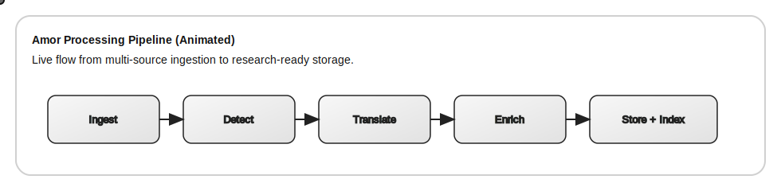
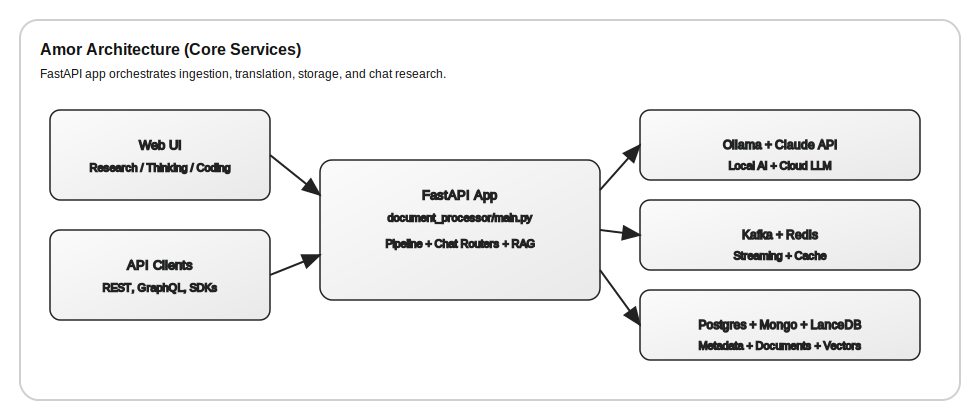
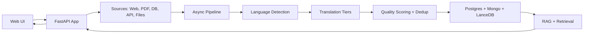

<div align="center">

```
    ___                          
   /   |  ____ ___  ____  _____  
  / /| | / __ `__ \/ __ \/ ___/  
 / ___ |/ / / / / / /_/ / /      
/_/  |_/_/ /_/ /_/\____/_/       
                                 
╔═══════════════════════════════════════════════════════════════╗
║  DISTRIBUTED ARTIFICIAL INTELLIGENCE DOCUMENT PROCESSING      ║
║          Multilingual • Multi-Agent • Production-Ready        ║
╚═══════════════════════════════════════════════════════════════╝
```

# Amor - Production-Ready Multi-Lingual Document Processing System

[](https://python.org)
[](https://fastapi.tiangolo.com)
[](https://docker.com)
[](https://kafka.apache.org)
[](https://redis.io)
[](https://postgresql.org)
[](https://mongodb.com)

[](https://opensource.org/licenses/MIT)
[](http://makeapullrequest.com)
[](https://github.com/devloper-gazi/Amor-Distributed-Artificial-Intelligence-System/graphs/commit-activity)

**A complete, enterprise-grade Python system for real-time processing, translation, and consolidation of hundreds of thousands of documents across multiple formats and languages.**

[Quick Start](#quick-start) • [Features](#features) • [Architecture](#architecture) • [Documentation](#-documentation) • [API](#usage)

</div>

---

# System Development Status

The system is under continuous development. You will find the latest stable and experimental versions documented below.

---

### 🟢 Version 0.1: Claude-Multi-Research
* **Status:** Stable / Released
* **Resource:** [Access via Proton Drive](https://drive.proton.me/urls/V5HM458KTC#CtsBGVYhvH0m)

### 🟡 Version 0.2: Amor
* **Status:** Active Development
* **Note:** Please be advised that this version is currently being prioritised for bug fixes. Existing issues have not yet been fully resolved, and performance may vary during this optimisation phase.

---
*Last updated: January 2026*

## Overview

**Amor** is a distributed artificial intelligence system designed for production-scale multilingual document processing and AI-powered research. It combines cutting-edge technologies to deliver a seamless experience for processing documents from diverse sources, performing intelligent translations, and conducting autonomous AI research.

```
┌─────────────────────────────────────────────────────────────────────────────┐
│                                                                             │
│   📄 DOCUMENTS        🌍 LANGUAGES       🤖 AI RESEARCH      📊 ANALYTICS   │
│   ─────────────       ───────────       ─────────────       ───────────    │
│   • Web Pages         • 150+ Languages  • Claude API        • Prometheus   │
│   • PDF Files         • Auto-Detection  • Local AI/Ollama   • Grafana      │
│   • Databases         • Multi-Tier      • CrewAI Agents     • Real-time    │
│   • APIs              • Translation     • Vector Search     • Dashboards   │
│   • Files (CSV/JSON)  • Memory Cache    • RAG Pipeline      • Alerting     │
│                                                                             │
└─────────────────────────────────────────────────────────────────────────────┘
```

### Key Capabilities

| Capability | Description | Performance |
|------------|-------------|-------------|
| **Document Ingestion** | Multi-format support (Web, PDF, DB, API, Files) | 10,000-50,000+ docs/sec |
| **Language Processing** | Auto-detection + Multi-tier translation | 150+ languages |
| **AI Research** | Dual-mode research (Cloud/Local) | Real-time streaming |
| **Storage** | Distributed persistence (PostgreSQL, MongoDB, Redis) | Petabyte-scale |
| **Event Streaming** | Apache Kafka with 50+ partitions | Millions of events/day |

---

## Why Amor?

<table>
<tr>
<td width="50%">

### 🎯 **Problem**
Organizations face challenges with:
- Processing documents in multiple languages
- Scaling document pipelines
- Running AI without cloud dependency
- Maintaining translation quality
- Real-time processing requirements

</td>
<td width="50%">

### ✅ **Solution**
Amor provides:
- **Unified pipeline** for all document types
- **Horizontal scaling** via Kafka + Docker
- **Offline AI** with Ollama integration
- **Multi-tier translation** with quality routing
- **Event-driven architecture** for real-time

</td>
</tr>
</table>

---

## Description

Amor is an end-to-end, containerized document processing and research platform. It ingests content from web, files, databases, and APIs, normalizes and translates it at scale, and exposes the results through a unified chat-first UI with Research, Thinking, and Coding modes. The system is designed for high throughput and operational resilience, combining async processing, event streaming, and multi-tier translation with deep observability.

### Animated pipeline overview

<p align="center">
  
</p>

**Explanation:** The animation depicts the core processing stages: ingestion, language detection, translation, enrichment, and storage/indexing. The moving nodes represent documents flowing through the pipeline, which is orchestrated by `document_processor/processing/pipeline.py` and guarded by circuit breakers and rate limiting in `document_processor/reliability/`.

### Architecture graphic

<p align="center">
  
</p>

**Explanation:** The Web UI and API clients call the FastAPI app (`document_processor/main.py`), which coordinates LLM providers (Claude API + Ollama), streaming services (Kafka + Redis), and storage backends (Postgres, MongoDB, LanceDB). Each subsystem has a dedicated module namespace, keeping the pipeline and chat features composable and testable.

### Data flow (Mermaid diagram)



### Technical details and explanations

- **Ingestion layer:** Implemented in `document_processor/sources/`, with source-specific adapters (web scraper, PDF processor, database connectors, file readers). Inputs stream into the pipeline to avoid large in-memory loads.
- **Pipeline orchestration:** `document_processor/processing/pipeline.py` coordinates extraction, detection, translation, quality checks, and storage. Concurrency is bounded with async semaphores to handle thousands of sources without saturating resources.
- **Translation strategy:** Tiered routing (Claude -> Google -> Azure) balances quality and cost, while Redis caching reduces repeated translations for near-duplicate content.
- **Chat research modes:** `document_processor/api/chat_research_routes.py` and `document_processor/api/local_ai_routes_simple.py` expose Research, Thinking, and Coding endpoints with shared UX in `web_ui/`.
- **Local AI + RAG:** Ollama-backed models (`local_ai/`) integrate with LanceDB for multilingual retrieval-augmented generation, optionally assisted by the NLLB translator.
- **Reliability & observability:** Circuit breakers, rate limiters, and retries live in `document_processor/reliability/`. Prometheus + Grafana dashboards and structured logging provide operational visibility.

This section is intentionally comprehensive to clarify how the UI, APIs, and infrastructure services collaborate end-to-end. For deeper payload examples, see `CHAT_RESEARCH_GUIDE.md`, `RESEARCH_GUIDE.md`, and `LOCAL_AI_SETUP.md`.

### 🌕 Development Notice ☀️
> ⚠️ **This project is actively being developed and may contain bugs. Please check the [Version History](https://github.com/devloper-gazi/Amor-Distributed-Artificial-Intelligence-System/blob/main/Version%20History.md) for updates.** 🛠️

---

## System Architecture

```
                                    ┌─────────────────────────────────────┐
                                    │           CLIENT LAYER              │
                                    │  ┌─────────┐ ┌─────────┐ ┌───────┐  │
                                    │  │ Web UI  │ │ REST API│ │GraphQL│  │
                                    │  └────┬────┘ └────┬────┘ └───┬───┘  │
                                    └───────┼──────────┼──────────┼──────┘
                                            │          │          │
                                            ▼          ▼          ▼
┌───────────────────────────────────────────────────────────────────────────┐
│                              GATEWAY LAYER (nginx:8000)                    │
│  ┌─────────────────────────────────────────────────────────────────────┐  │
│  │   Load Balancing • Rate Limiting • SSL Termination • Routing        │  │
│  └─────────────────────────────────────────────────────────────────────┘  │
└───────────────────────────────────────────────────────────────────────────┘
                                            │
                                            ▼
┌───────────────────────────────────────────────────────────────────────────┐
│                          APPLICATION LAYER (FastAPI)                       │
│  ┌─────────────┐  ┌─────────────┐  ┌─────────────┐  ┌─────────────────┐   │
│  │  Chat API   │  │  Local AI   │  │  Pipeline   │  │  Translation    │   │
│  │  /api/chat  │  │ /api/local  │  │  /process   │  │  /translate     │   │
│  │             │  │             │  │             │  │                 │   │
│  │ • Research  │  │ • Ollama    │  │ • Ingestion │  │ • Claude        │   │
│  │ • Thinking  │  │ • CrewAI    │  │ • Transform │  │ • Google        │   │
│  │ • Coding    │  │ • LanceDB   │  │ • Validate  │  │ • Azure         │   │
│  └──────┬──────┘  └──────┬──────┘  └──────┬──────┘  └────────┬────────┘   │
└─────────┼────────────────┼────────────────┼──────────────────┼────────────┘
          │                │                │                  │
          ▼                ▼                ▼                  ▼
┌───────────────────────────────────────────────────────────────────────────┐
│                        PROCESSING LAYER (Async Python)                     │
│  ┌─────────────────────────────────────────────────────────────────────┐  │
│  │  ┌──────────┐  ┌──────────┐  ┌──────────┐  ┌──────────┐  ┌───────┐  │  │
│  │  │ Language │→ │ Quality  │→ │ Dedupe   │→ │ Translate│→ │ Store │  │  │
│  │  │ Detector │  │ Checker  │  │ (Bloom)  │  │ Router   │  │       │  │  │
│  │  └──────────┘  └──────────┘  └──────────┘  └──────────┘  └───────┘  │  │
│  │                                                                      │  │
│  │  ┌──────────────────────────────────────────────────────────────┐   │  │
│  │  │  Circuit Breakers • Rate Limiters • Retry Logic • Backoff    │   │  │
│  │  └──────────────────────────────────────────────────────────────┘   │  │
│  └─────────────────────────────────────────────────────────────────────┘  │
└───────────────────────────────────────────────────────────────────────────┘
                                            │
                                            ▼
┌───────────────────────────────────────────────────────────────────────────┐
│                         DATA & MESSAGING LAYER                             │
│                                                                            │
│  ┌─────────────┐  ┌─────────────┐  ┌─────────────┐  ┌─────────────────┐   │
│  │   Apache    │  │   Redis     │  │ PostgreSQL  │  │    MongoDB      │   │
│  │   Kafka     │  │   Cache     │  │  Metadata   │  │   Documents     │   │
│  │             │  │             │  │             │  │                 │   │
│  │ • 50+ parts │  │ • Sessions  │  │ • Metadata  │  │ • Full content  │   │
│  │ • DLQ       │  │ • Trans mem │  │ • Stats     │  │ • Chat history  │   │
│  │ • Events    │  │ • Rate lim  │  │ • Indexes   │  │ • Vectors       │   │
│  └─────────────┘  └─────────────┘  └─────────────┘  └─────────────────┘   │
│                                                                            │
└───────────────────────────────────────────────────────────────────────────┘
                                            │
                                            ▼
┌───────────────────────────────────────────────────────────────────────────┐
│                        OBSERVABILITY LAYER                                 │
│  ┌───────────────────────┐  ┌───────────────────────┐  ┌───────────────┐  │
│  │     Prometheus        │  │       Grafana         │  │   Structured  │  │
│  │     Metrics           │  │     Dashboards        │  │    Logging    │  │
│  │                       │  │                       │  │               │  │
│  │ • Request latency     │  │ • Crawl statistics   │  │ • JSON format │  │
│  │ • Throughput          │  │ • Translation stats   │  │ • Correlation │  │
│  │ • Error rates         │  │ • Storage errors      │  │ • Tracing     │  │
│  │ • Resource usage      │  │ • Custom alerts       │  │ • OpenTelemetry│ │
│  └───────────────────────┘  └───────────────────────┘  └───────────────┘  │
└───────────────────────────────────────────────────────────────────────────┘
```

### Data Flow Animation

```
Document Ingestion Flow:
═══════════════════════

  [Source]          [Detection]         [Translation]        [Storage]
     │                  │                    │                   │
     │   ┌──────────┐   │   ┌──────────┐    │   ┌──────────┐   │
     └──►│  Ingest  │───┴──►│  Detect  │────┴──►│Translate │───┴──► [DB]
         │          │       │ Language │        │  (Multi  │
         │ • Web    │       │          │        │   Tier)  │
         │ • PDF    │       │ FastText │        │          │
         │ • API    │       │ 150+ lang│        │ Quality→ │
         │ • DB     │       │          │        │ Balanced→│
         └──────────┘       └──────────┘        │ Volume→  │
                                                └──────────┘
              ↓                  ↓                   ↓
         ┌────────┐         ┌────────┐         ┌────────┐
         │ Kafka  │◄───────►│ Redis  │◄───────►│  DLQ   │
         │ Events │         │ Cache  │         │ Retry  │
         └────────┘         └────────┘         └────────┘
```

---

## Features

### 🌍 Multi-Source Document Support

Amor supports ingestion from virtually any document source with specialized processors for each format:

```
┌─────────────────────────────────────────────────────────────────────────────┐
│                        SUPPORTED DOCUMENT SOURCES                           │
├─────────────────────────────────────────────────────────────────────────────┤
│                                                                             │
│   🌐 WEB PAGES                    📄 PDF DOCUMENTS                          │
│   ├─ HTTP/HTTPS protocols        ├─ Native text extraction                │
│   ├─ JavaScript rendering        ├─ OCR for scanned docs                  │
│   ├─ Playwright automation       ├─ 150+ language OCR                     │
│   └─ Rate-limited crawling       └─ Table extraction                      │
│                                                                             │
│   🗄️ DATABASES                    🔌 APIs                                   │
│   ├─ PostgreSQL                  ├─ REST endpoints                        │
│   ├─ MySQL                       ├─ GraphQL queries                       │
│   ├─ MongoDB                     ├─ OAuth2/API key auth                   │
│   └─ Custom connectors           └─ Pagination handling                   │
│                                                                             │
│   📁 FILE FORMATS                                                           │
│   ├─ CSV, JSON, XML              ├─ Excel (.xlsx, .xls)                   │
│   ├─ Word (.docx)                ├─ Plain text (.txt)                     │
│   └─ Custom parsers              └─ Archives (.zip)                       │
│                                                                             │
└─────────────────────────────────────────────────────────────────────────────┘
```

### 🗣️ Advanced Language Processing

Amor implements a sophisticated multi-tier translation system with intelligent routing based on priority and quality requirements:

```
┌─────────────────────────────────────────────────────────────────────────────┐
│                    MULTI-TIER TRANSLATION ARCHITECTURE                      │
├─────────────────────────────────────────────────────────────────────────────┤
│                                                                             │
│   INPUT                    DETECTION                 ROUTING                │
│   ─────                    ─────────                 ───────                │
│                                                                             │
│   ┌──────┐     ┌────────────────────┐     ┌────────────────────────┐       │
│   │ Text │────►│   FastText Model   │────►│   Quality Router       │       │
│   └──────┘     │   (150+ languages) │     │                        │       │
│                │                    │     │  Priority = "quality"  │       │
│                │   Confidence: 99%+ │     │        ↓               │       │
│                └────────────────────┘     │  ┌──────────────┐      │       │
│                                           │  │ TIER 1       │      │       │
│                                           │  │ Claude 3.5   │──────┼──┐    │
│                                           │  │ Sonnet       │      │  │    │
│   ┌──────────────────────────────────┐   │  └──────────────┘      │  │    │
│   │     SUPPORTED LANGUAGES          │   │                        │  │    │
│   │                                  │   │  Priority = "balanced" │  │    │
│   │  🇬🇧 English    🇫🇷 French       │   │        ↓               │  │    │
│   │  🇩🇪 German     🇪🇸 Spanish      │   │  ┌──────────────┐      │  │    │
│   │  🇯🇵 Japanese   🇨🇳 Chinese      │   │  │ TIER 2       │      │  │    │
│   │  🇰🇷 Korean     🇷🇺 Russian      │   │  │ Google Cloud │──────┼──┤    │
│   │  🇵🇹 Portuguese 🇮🇹 Italian      │   │  │ Translation  │      │  │    │
│   │  🇳🇱 Dutch      🇸🇪 Swedish      │   │  └──────────────┘      │  │    │
│   │  🇵🇱 Polish     🇹🇷 Turkish      │   │                        │  │    │
│   │  🇻🇳 Vietnamese 🇹🇭 Thai         │   │  Priority = "volume"   │  │    │
│   │  🇮🇳 Hindi      🇸🇦 Arabic       │   │        ↓               │  │    │
│   │  + 130 more languages...        │   │  ┌──────────────┐      │  ▼    │
│   │                                  │   │  │ TIER 3       │      │       │
│   └──────────────────────────────────┘   │  │ Azure        │──────┼──►OUT │
│                                           │  │ Translator   │      │       │
│                                           │  └──────────────┘      │       │
│                                           └────────────────────────┘       │
│                                                                             │
│   CACHING & MEMORY                                                          │
│   ────────────────                                                          │
│   ┌─────────────────────────────────────────────────────────────────┐      │
│   │  Redis Translation Memory                                        │      │
│   │  ├─ 5-minute TTL for hot translations                           │      │
│   │  ├─ Language pair caching                                       │      │
│   │  ├─ Fuzzy match support                                         │      │
│   │  └─ Cache hit rates: 60-80% typical                             │      │
│   └─────────────────────────────────────────────────────────────────┘      │
│                                                                             │
└─────────────────────────────────────────────────────────────────────────────┘
```

### ⚡ Performance & Scalability

Amor is engineered for high-throughput, low-latency document processing at scale:

```
┌─────────────────────────────────────────────────────────────────────────────┐
│                         PERFORMANCE CHARACTERISTICS                         │
├─────────────────────────────────────────────────────────────────────────────┤
│                                                                             │
│   THROUGHPUT                           LATENCY                              │
│   ──────────                           ───────                              │
│                                                                             │
│   Documents/Second                     P50: 45ms ████░░░░░░░░░░░░░░         │
│   ┌────────────────────────────┐       P95: 120ms ██████████░░░░░░░░        │
│   │ ████████████████████ 50K   │       P99: 250ms █████████████░░░░░        │
│   │ ████████████████     40K   │                                            │
│   │ ████████████         30K   │       CONCURRENT CONNECTIONS               │
│   │ ████████             20K   │       ──────────────────────               │
│   │ ████                 10K   │       ┌──────────────────────┐             │
│   └────────────────────────────┘       │   1,000+ sources     │             │
│     Peak      Sustained  Min           │   simultaneously     │             │
│                                        └──────────────────────┘             │
│                                                                             │
├─────────────────────────────────────────────────────────────────────────────┤
│                                                                             │
│   HORIZONTAL SCALING                                                        │
│   ──────────────────                                                        │
│                                                                             │
│   ┌─────────┐    ┌─────────┐    ┌─────────┐    ┌─────────┐                 │
│   │  App    │    │  App    │    │  App    │    │  App    │                 │
│   │ Worker 1│    │ Worker 2│    │ Worker 3│    │ Worker N│                 │
│   └────┬────┘    └────┬────┘    └────┬────┘    └────┬────┘                 │
│        │              │              │              │                       │
│        └──────────────┴──────────────┴──────────────┘                       │
│                              │                                              │
│                              ▼                                              │
│        ┌────────────────────────────────────────────┐                       │
│        │              Apache Kafka                  │                       │
│        │        50+ Partitions / Topic             │                       │
│        │     Consumer Groups for Parallelism        │                       │
│        └────────────────────────────────────────────┘                       │
│                                                                             │
│   MEMORY OPTIMIZATION                                                       │
│   ───────────────────                                                       │
│                                                                             │
│   • Streaming document processing (no full load to memory)                  │
│   • Chunked translation (4KB segments)                                      │
│   • Async I/O with asyncio.Semaphore (1000 concurrent)                     │
│   • Lazy loading of ML models                                               │
│   • LRU caches for frequent operations                                      │
│                                                                             │
└─────────────────────────────────────────────────────────────────────────────┘
```

### 🛡️ Production-Ready Reliability

Enterprise-grade reliability features ensure robust operation under all conditions:

```
┌─────────────────────────────────────────────────────────────────────────────┐
│                         RELIABILITY FEATURES                                │
├─────────────────────────────────────────────────────────────────────────────┤
│                                                                             │
│   CIRCUIT BREAKERS                     RETRY LOGIC                          │
│   ────────────────                     ───────────                          │
│                                                                             │
│   ┌─────────┐  5 failures   ┌─────┐   ┌──────────────────────────────┐     │
│   │ CLOSED  │──────────────►│OPEN │   │  Exponential Backoff         │     │
│   │(normal) │               │     │   │                              │     │
│   └────┬────┘               └──┬──┘   │  Attempt 1: 2 seconds        │     │
│        │                      │       │  Attempt 2: 4 seconds        │     │
│        │     60s timeout      │       │  Attempt 3: 8 seconds        │     │
│        │  ◄───────────────────┤       │  Attempt 4: 16 seconds       │     │
│        ▼                      │       │  Attempt 5: 32-60 seconds    │     │
│   ┌─────────┐                 │       │                              │     │
│   │  HALF   │◄────────────────┘       │  Max attempts: 5             │     │
│   │  OPEN   │  success→close          │  Max delay: 60 seconds       │     │
│   └─────────┘  failure→open           └──────────────────────────────┘     │
│                                                                             │
├─────────────────────────────────────────────────────────────────────────────┤
│                                                                             │
│   RATE LIMITING                        ERROR HANDLING                       │
│   ─────────────                        ──────────────                       │
│                                                                             │
│   Token Bucket Algorithm               Dead Letter Queue (DLQ)              │
│   ┌────────────────────┐               ┌────────────────────────────┐      │
│   │  ◉◉◉◉◉◉◉◉◉◉       │               │                            │      │
│   │  Tokens: 100/sec   │               │  Failed Message            │      │
│   │                    │               │       ↓                    │      │
│   │  Refill: 10/sec    │               │  Retry Queue (3x)          │      │
│   │                    │               │       ↓                    │      │
│   │  Per-provider      │               │  DLQ Topic                 │      │
│   │  isolation         │               │       ↓                    │      │
│   └────────────────────┘               │  Manual Review             │      │
│                                        └────────────────────────────┘      │
│                                                                             │
├─────────────────────────────────────────────────────────────────────────────┤
│                                                                             │
│   DEDUPLICATION                        MONITORING                           │
│   ─────────────                        ──────────                           │
│                                                                             │
│   Bloom Filter                         Prometheus + Grafana                 │
│   ┌────────────────────┐               ┌────────────────────────────┐      │
│   │  Capacity: 1M docs │               │  📊 Real-time dashboards   │      │
│   │  Error rate: 1%    │               │  📈 Custom metrics         │      │
│   │  Memory: ~1.2MB    │               │  🚨 Alerting rules         │      │
│   │                    │               │  📝 Structured logging     │      │
│   │  Hash functions: 7 │               │  🔍 OpenTelemetry tracing  │      │
│   └────────────────────┘               └────────────────────────────┘      │
│                                                                             │
└─────────────────────────────────────────────────────────────────────────────┘
```

### 🤖 Dual AI Research Modes

Amor provides two distinct AI-powered research modes for maximum flexibility:

```
┌─────────────────────────────────────────────────────────────────────────────┐
│                         AI RESEARCH CAPABILITIES                            │
├─────────────────────────────────────────────────────────────────────────────┤
│                                                                             │
│   ┌─────────────────────────────────┐ ┌─────────────────────────────────┐  │
│   │      ☁️  CLAUDE API MODE        │ │      🖥️  LOCAL AI MODE          │  │
│   │         (Cloud-Based)           │ │         (Offline)               │  │
│   ├─────────────────────────────────┤ ├─────────────────────────────────┤  │
│   │                                 │ │                                 │  │
│   │  Provider: Anthropic Claude     │ │  Provider: Ollama               │  │
│   │  Model: Claude 3.5 Sonnet       │ │  Model: Qwen 2.5 (7B/14B)       │  │
│   │                                 │ │                                 │  │
│   │  ✓ Highest quality responses    │ │  ✓ Complete privacy             │  │
│   │  ✓ Latest knowledge cutoff      │ │  ✓ No API costs                 │  │
│   │  ✓ Fast response times          │ │  ✓ Offline operation            │  │
│   │  ✓ Extended context window      │ │  ✓ Custom fine-tuning           │  │
│   │                                 │ │                                 │  │
│   │  Endpoints:                     │ │  Endpoints:                     │  │
│   │  POST /api/chat/research        │ │  POST /api/local-ai/research    │  │
│   │  POST /api/chat/thinking        │ │  POST /api/local-ai/thinking    │  │
│   │  POST /api/chat/coding          │ │  POST /api/local-ai/coding      │  │
│   │                                 │ │                                 │  │
│   └─────────────────────────────────┘ └─────────────────────────────────┘  │
│                                                                             │
│   LOCAL AI ARCHITECTURE                                                     │
│   ─────────────────────                                                     │
│                                                                             │
│   ┌─────────────────────────────────────────────────────────────────────┐  │
│   │                                                                     │  │
│   │   ┌──────────────┐    ┌──────────────┐    ┌──────────────┐         │  │
│   │   │  Research    │    │    Data      │    │  Technical   │         │  │
│   │   │  Specialist  │───►│   Analyst    │───►│   Writer     │         │  │
│   │   │   (Agent)    │    │   (Agent)    │    │   (Agent)    │         │  │
│   │   └──────────────┘    └──────────────┘    └──────────────┘         │  │
│   │          │                   │                   │                  │  │
│   │          ▼                   ▼                   ▼                  │  │
│   │   ┌──────────────────────────────────────────────────────┐         │  │
│   │   │                  CrewAI Orchestration                │         │  │
│   │   └──────────────────────────────────────────────────────┘         │  │
│   │                              │                                      │  │
│   │          ┌───────────────────┼───────────────────┐                 │  │
│   │          ▼                   ▼                   ▼                  │  │
│   │   ┌──────────┐        ┌──────────┐        ┌──────────┐             │  │
│   │   │  Ollama  │        │ LanceDB  │        │   NLLB   │             │  │
│   │   │   LLM    │        │ Vectors  │        │ Translate│             │  │
│   │   │ (4.5GB)  │        │  (768d)  │        │ (600MB)  │             │  │
│   │   └──────────┘        └──────────┘        └──────────┘             │  │
│   │                                                                     │  │
│   │   Total VRAM: ~5.1GB / 8GB (RTX 4060 optimized)                    │  │
│   │                                                                     │  │
│   └─────────────────────────────────────────────────────────────────────┘  │
│                                                                             │
└─────────────────────────────────────────────────────────────────────────────┘
```

### 🎨 Modern Web Interface

A sleek, responsive chat interface with three specialized modes:

```
┌─────────────────────────────────────────────────────────────────────────────┐
│                          AMOR WEB INTERFACE                                 │
├─────────────────────────────────────────────────────────────────────────────┤
│                                                                             │
│   ┌─────────────────────────────────────────────────────────────────────┐  │
│   │  ┌─────────┐  ┌─────────┐  ┌─────────┐         ┌──────────────┐    │  │
│   │  │Research │  │Thinking │  │ Coding  │         │ ⚙️ Settings  │    │  │
│   │  │  Mode   │  │  Mode   │  │  Mode   │         │              │    │  │
│   │  └─────────┘  └─────────┘  └─────────┘         └──────────────┘    │  │
│   ├─────────────────────────────────────────────────────────────────────┤  │
│   │                                                                     │  │
│   │   📚 RESEARCH MODE          🧠 THINKING MODE       💻 CODING MODE  │  │
│   │   ─────────────────         ─────────────────      ──────────────  │  │
│   │   Multi-step research       Deep reasoning         Code generation │  │
│   │   Source gathering          Analysis & planning    Refactoring     │  │
│   │   Fact synthesis            Problem solving        Debugging       │  │
│   │   Citation tracking         Decision making        Best practices  │  │
│   │                                                                     │  │
│   ├─────────────────────────────────────────────────────────────────────┤  │
│   │                                                                     │  │
│   │   ┌─────────────────────────────────────────────────────────────┐  │  │
│   │   │                                                             │  │  │
│   │   │   💬 Chat History                                           │  │  │
│   │   │                                                             │  │  │
│   │   │   ┌───────────────────────────────────────────────────┐    │  │  │
│   │   │   │ 👤 What are the latest developments in quantum    │    │  │  │
│   │   │   │    computing?                                      │    │  │  │
│   │   │   └───────────────────────────────────────────────────┘    │  │  │
│   │   │                                                             │  │  │
│   │   │   ┌───────────────────────────────────────────────────┐    │  │  │
│   │   │   │ 🤖 Based on recent research, quantum computing     │    │  │  │
│   │   │   │    has seen significant advances in...             │    │  │  │
│   │   │   │    [Sources: Nature, arXiv, IEEE]                  │    │  │  │
│   │   │   └───────────────────────────────────────────────────┘    │  │  │
│   │   │                                                             │  │  │
│   │   └─────────────────────────────────────────────────────────────┘  │  │
│   │                                                                     │  │
│   │   ┌─────────────────────────────────────────────────────────────┐  │  │
│   │   │  Type your research question...                    [Send ▶] │  │  │
│   │   └─────────────────────────────────────────────────────────────┘  │  │
│   │                                                                     │  │
│   └─────────────────────────────────────────────────────────────────────┘  │
│                                                                             │
│   FEATURES                                                                  │
│   ────────                                                                  │
│   ✓ Dark theme (easy on eyes)    ✓ Real-time streaming responses           │
│   ✓ Mobile responsive            ✓ Session persistence (MongoDB)           │
│   ✓ Keyboard shortcuts           ✓ Export conversations                    │
│   ✓ Code syntax highlighting     ✓ Progress indicators                     │
│                                                                             │
└─────────────────────────────────────────────────────────────────────────────┘
```

---

## Quick Start

### Prerequisites

```
┌─────────────────────────────────────────────────────────────────────────────┐
│                          SYSTEM REQUIREMENTS                                │
├─────────────────────────────────────────────────────────────────────────────┤
│                                                                             │
│   MINIMUM                              RECOMMENDED                          │
│   ───────                              ───────────                          │
│                                                                             │
│   💾 RAM:      8 GB                    💾 RAM:      16 GB                   │
│   💿 Storage:  20 GB                   💿 Storage:  50 GB                   │
│   🖥️  CPU:      4 cores                🖥️  CPU:      8 cores                │
│   🎮 GPU:      None                    🎮 GPU:      NVIDIA RTX 4060+ (8GB)  │
│                                                                             │
│   REQUIRED SOFTWARE                                                         │
│   ─────────────────                                                         │
│                                                                             │
│   ┌──────────────────────────────────────────────────────────────────┐     │
│   │  🐳 Docker Desktop 24.0+                                         │     │
│   │     ├─ Windows: docker.com/products/docker-desktop              │     │
│   │     ├─ macOS: docker.com/products/docker-desktop                │     │
│   │     └─ Linux: docs.docker.com/engine/install                    │     │
│   │                                                                  │     │
│   │  📦 Docker Compose (included with Docker Desktop)                │     │
│   │                                                                  │     │
│   │  🔧 For GPU support (optional):                                  │     │
│   │     └─ NVIDIA Container Toolkit + CUDA 11.8+                    │     │
│   └──────────────────────────────────────────────────────────────────┘     │
│                                                                             │
└─────────────────────────────────────────────────────────────────────────────┘
```

### Installation & Setup

#### Option 1: Automated Startup (Recommended)

**Linux/Mac:**
```bash
git clone https://github.com/devloper-gazi/Claude-Multi-Research.git
cd Claude-Multi-Research
cp .env.example .env
# Edit .env and add your API keys

# Run the startup script
./start.sh
```

**Windows (PowerShell):**
```powershell
git clone https://github.com/devloper-gazi/Claude-Multi-Research.git
cd Claude-Multi-Research
Copy-Item .env.example .env
# Edit .env and add your API keys

# Run the startup script
.\start.ps1
```

#### Option 2: Manual Docker Compose

**Linux/Mac:**
```bash
git clone https://github.com/devloper-gazi/Claude-Multi-Research.git
cd Claude-Multi-Research
cp .env.example .env
# Edit .env and add your API keys

# Start all services
docker-compose up -d
```

**Windows:**
```powershell
git clone https://github.com/devloper-gazi/Claude-Multi-Research.git
cd Claude-Multi-Research
Copy-Item .env.example .env
# Edit .env and add your API keys

# Start all services with Windows configuration
docker-compose -f docker-compose.yml -f docker-compose.windows.yml up -d
```

### Access the Services

Once started, access the following URLs:
- **Amor Web UI**: `http://localhost:8000`
- **API Docs**: `http://localhost:8000/docs`
- **Metrics**: `http://localhost:8000/metrics`

If you can only expose a single port (8000), monitoring UIs are also available via:
- **Grafana (via 8000)**: `http://localhost:8000/grafana/` (admin/admin123)
- **Prometheus (via 8000)**: `http://localhost:8000/prometheus/`

Direct access (optional, if those ports are allowed):
- **Grafana**: `http://localhost:3000` (admin/admin123)
- **Prometheus**: `http://localhost:9091`

---

## Amor Research Modes & API Overview

Amor exposes two research providers that share a unified chat-first UI (research / thinking / coding modes) and common UX:

- **Claude API mode** (cloud):
  - Uses Anthropic’s Claude models via `ANTHROPIC_API_KEY`.
  - Endpoints are under `"/api/chat/*"` (for example `POST /api/chat/research`, `/api/chat/thinking`, `/api/chat/coding`).
  - Best when you want highest quality answers and are online.

- **Local AI mode** (offline):
  - Uses the `ollama` service (container name `amor-ollama`) running a local model such as `qwen2.5:7b`.
  - Endpoints are under `"/api/local-ai/*"` (for example `POST /api/local-ai/research`, `/api/local-ai/thinking`, `/api/local-ai/coding`).
  - Can optionally use the local NLLB translator and LanceDB vector store for multilingual, retrieval-augmented research.

The main API entrypoints for checking research availability are:

- `GET /api` – high-level flags: `chat_research_available`, `local_ai_available`, `crawling_available`, `translation_available`.
- `GET /api/chat/health` – Claude API configuration and connectivity.
- `GET /api/local-ai/health` – Local AI + Ollama + translation readiness.

See `CHAT_RESEARCH_GUIDE.md`, `RESEARCH_GUIDE.md`, and `LOCAL_AI_SETUP.md` for mode-specific payloads and examples.

---

---

## Docker Stack (Amor)

The Docker Compose file defines a complete, production-ready stack with the project name **`amor`**:

```
┌─────────────────────────────────────────────────────────────────────────────┐
│                         AMOR DOCKER STACK                                   │
│                       Project Name: amor                                    │
├─────────────────────────────────────────────────────────────────────────────┤
│                                                                             │
│   ┌───────────────────────────────────────────────────────────────────┐    │
│   │                    GATEWAY (nginx:8000)                           │    │
│   │   ────────────────────────────────────────────────────────────    │    │
│   │   Routes: / → App | /grafana → Grafana | /prometheus → Prom      │    │
│   │   Features: Load balancing, SSL termination, Rate limiting        │    │
│   └───────────────────────────────────────────────────────────────────┘    │
│                                    │                                        │
│            ┌───────────────────────┼───────────────────────┐               │
│            ▼                       ▼                       ▼                │
│   ┌─────────────────┐    ┌─────────────────┐    ┌─────────────────┐       │
│   │       APP       │    │     OLLAMA      │    │   MONITORING    │       │
│   │    (FastAPI)    │    │   (Local LLM)   │    │                 │       │
│   │                 │    │                 │    │ ┌─────────────┐ │       │
│   │ • 2 replicas    │    │ • amor-ollama   │    │ │ Prometheus  │ │       │
│   │ • 4GB RAM limit │    │ • Port 11434    │    │ │  (9091)     │ │       │
│   │ • Chat APIs     │    │ • Qwen 2.5 7B   │    │ └─────────────┘ │       │
│   │ • Pipeline APIs │    │ • GPU enabled   │    │ ┌─────────────┐ │       │
│   │ • Web UI        │    │                 │    │ │  Grafana    │ │       │
│   └────────┬────────┘    └─────────────────┘    │ │  (3000)     │ │       │
│            │                                     │ └─────────────┘ │       │
│            │                                     └─────────────────┘       │
│            │                                                                │
│   ┌────────┴────────────────────────────────────────────────────────┐     │
│   │                     DATA & MESSAGING LAYER                       │     │
│   │                                                                  │     │
│   │  ┌──────────┐  ┌──────────┐  ┌──────────┐  ┌──────────┐        │     │
│   │  │  Kafka   │  │  Redis   │  │ Postgres │  │  MongoDB │        │     │
│   │  │  (9092)  │  │  (6379)  │  │  (5432)  │  │  (27017) │        │     │
│   │  │          │  │          │  │          │  │          │        │     │
│   │  │ • Events │  │ • Cache  │  │ • Meta   │  │ • Docs   │        │     │
│   │  │ • 50+    │  │ • Rate   │  │ • Stats  │  │ • Chat   │        │     │
│   │  │   parts  │  │   limit  │  │ • Index  │  │ • Vector │        │     │
│   │  └──────────┘  └──────────┘  └──────────┘  └──────────┘        │     │
│   │                                                                  │     │
│   │  ┌──────────┐  ┌──────────────────────────────────────┐        │     │
│   │  │Zookeeper │  │           LanceDB Volume             │        │     │
│   │  │  (2181)  │  │     /data/vectors (Vector Store)     │        │     │
│   │  └──────────┘  └──────────────────────────────────────┘        │     │
│   │                                                                  │     │
│   └──────────────────────────────────────────────────────────────────┘     │
│                                                                             │
└─────────────────────────────────────────────────────────────────────────────┘

Service Summary:
╔════════════════╤══════════════════════════════════════════════════════════╗
║ Service        │ Description                                              ║
╠════════════════╪══════════════════════════════════════════════════════════╣
║ gateway        │ Nginx reverse proxy (exposes port 8000)                  ║
║ app            │ FastAPI application (2 replicas, 4GB RAM)                ║
║ ollama         │ Local LLM service (container: amor-ollama)               ║
║ kafka          │ Event streaming (50+ partitions)                         ║
║ zookeeper      │ Kafka coordination                                       ║
║ redis          │ Cache + rate limiting                                    ║
║ postgres       │ Document metadata + statistics                           ║
║ mongo          │ Full documents + chat sessions                           ║
║ prometheus     │ Metrics collection                                       ║
║ grafana        │ Visualization dashboards                                 ║
╚════════════════╧══════════════════════════════════════════════════════════╝
```

Key research-related environment variables (set via `.env` and consumed by the `app` service):

- `ANTHROPIC_API_KEY` – required for Claude API research mode.
- `OLLAMA_BASE_URL` – defaults to `http://ollama:11434` (service name `ollama`).
- `OLLAMA_MODEL` – default `qwen2.5:7b`, can be changed to any installed Ollama model.
- `OLLAMA_AUTO_PULL` – when `true`, the app may attempt to pull the model automatically on first use (requires internet).

## Usage

### REST API Example

```python
import requests

# Process a web page
response = requests.post('http://localhost:8000/process/single', json={
    "source_type": "web",
    "source_url": "https://example.com/article",
    "priority": "balanced"
})

# Batch processing
response = requests.post('http://localhost:8000/process', json={
    "sources": [
        {"source_type": "web", "source_url": "https://example1.com"},
        {"source_type": "pdf", "source_path": "/path/to/doc.pdf"}
    ],
    "async_processing": true
})
```

## Configuration

Key environment variables in `.env`:

```bash
# Translation API Keys (Required)
ANTHROPIC_API_KEY=your-key
GOOGLE_TRANSLATE_API_KEY=your-key
AZURE_TRANSLATOR_KEY=your-key

# Processing
MAX_CONCURRENT_SOURCES=1000
BATCH_SIZE=1000

# Infrastructure
KAFKA_BOOTSTRAP_SERVERS=kafka:9092
REDIS_HOST=redis
```

---

## Monitoring & Observability

```
┌─────────────────────────────────────────────────────────────────────────────┐
│                      MONITORING & OBSERVABILITY                             │
├─────────────────────────────────────────────────────────────────────────────┤
│                                                                             │
│   ┌─────────────────────────────────────────────────────────────────────┐  │
│   │                        GRAFANA DASHBOARDS                           │  │
│   │                   http://localhost:3000 (admin/admin123)            │  │
│   │                   http://localhost:8000/grafana/                    │  │
│   │                                                                     │  │
│   │  ┌──────────────────┐ ┌──────────────────┐ ┌──────────────────┐    │  │
│   │  │ Crawl Statistics │ │Translation Stats │ │  Storage Errors  │    │  │
│   │  │                  │ │                  │ │                  │    │  │
│   │  │ ┌────────────┐  │ │ ┌────────────┐  │ │ ┌────────────┐  │    │  │
│   │  │ │ ████████   │  │ │ │ ████░░░░   │  │ │ │ ██░░░░░░░░ │  │    │  │
│   │  │ │ ██████████ │  │ │ │ ██████░░░  │  │ │ │ ███░░░░░░░ │  │    │  │
│   │  │ │ ████████   │  │ │ │ ████████░░ │  │ │ │ █░░░░░░░░░ │  │    │  │
│   │  │ └────────────┘  │ │ └────────────┘  │ │ └────────────┘  │    │  │
│   │  │ Sources/hour    │ │ Languages       │ │ Error rate      │    │  │
│   │  └──────────────────┘ └──────────────────┘ └──────────────────┘    │  │
│   │                                                                     │  │
│   └─────────────────────────────────────────────────────────────────────┘  │
│                                                                             │
│   ┌─────────────────────────────────────────────────────────────────────┐  │
│   │                       PROMETHEUS METRICS                            │  │
│   │                http://localhost:9091 or /prometheus/                │  │
│   │                                                                     │  │
│   │  Available Metrics:                                                 │  │
│   │  ├─ amor_documents_processed_total                                  │  │
│   │  ├─ amor_translation_requests_total                                 │  │
│   │  ├─ amor_translation_latency_seconds                                │  │
│   │  ├─ amor_cache_hit_ratio                                            │  │
│   │  ├─ amor_pipeline_errors_total                                      │  │
│   │  ├─ amor_active_connections                                         │  │
│   │  └─ amor_queue_depth                                                │  │
│   │                                                                     │  │
│   └─────────────────────────────────────────────────────────────────────┘  │
│                                                                             │
│   ┌─────────────────────────────────────────────────────────────────────┐  │
│   │                       STRUCTURED LOGGING                            │  │
│   │                                                                     │  │
│   │  Format: JSON (via structlog)                                       │  │
│   │  Correlation: Request IDs across services                           │  │
│   │  Tracing: OpenTelemetry (when ENABLE_TRACING=true)                  │  │
│   │                                                                     │  │
│   │  View logs:                                                         │  │
│   │  $ docker compose logs -f app                                       │  │
│   │  $ docker compose logs -f ollama                                    │  │
│   │  $ docker compose logs -f kafka                                     │  │
│   │                                                                     │  │
│   └─────────────────────────────────────────────────────────────────────┘  │
│                                                                             │
│   ACCESS POINTS                                                             │
│   ─────────────                                                             │
│   ┌──────────────────────┬──────────────────────────────────────────┐      │
│   │ Service              │ URL                                      │      │
│   ├──────────────────────┼──────────────────────────────────────────┤      │
│   │ Prometheus (direct)  │ http://localhost:9091                    │      │
│   │ Prometheus (gateway) │ http://localhost:8000/prometheus/        │      │
│   │ Grafana (direct)     │ http://localhost:3000 (admin/admin123)   │      │
│   │ Grafana (gateway)    │ http://localhost:8000/grafana/           │      │
│   │ Application Metrics  │ http://localhost:8000/metrics            │      │
│   │ API Documentation    │ http://localhost:8000/docs               │      │
│   └──────────────────────┴──────────────────────────────────────────┘      │
│                                                                             │
└─────────────────────────────────────────────────────────────────────────────┘
```

## Detailed Architecture

### Processing Pipeline Flow

```
┌─────────────────────────────────────────────────────────────────────────────┐
│                      DOCUMENT PROCESSING PIPELINE                           │
├─────────────────────────────────────────────────────────────────────────────┤
│                                                                             │
│   PHASE 1: INGESTION                                                        │
│   ──────────────────                                                        │
│                                                                             │
│   ┌─────────┐   ┌─────────┐   ┌─────────┐   ┌─────────┐   ┌─────────┐     │
│   │   Web   │   │   PDF   │   │Database │   │   API   │   │  Files  │     │
│   │ Scraper │   │ Parser  │   │Connector│   │ Client  │   │ Reader  │     │
│   └────┬────┘   └────┬────┘   └────┬────┘   └────┬────┘   └────┬────┘     │
│        │             │             │             │             │           │
│        └─────────────┴─────────────┴─────────────┴─────────────┘           │
│                                    │                                        │
│                                    ▼                                        │
│   ┌─────────────────────────────────────────────────────────────────────┐  │
│   │                     UNIFIED DOCUMENT STREAM                         │  │
│   │   { id, source_type, content, metadata, extracted_at }              │  │
│   └─────────────────────────────────────────────────────────────────────┘  │
│                                    │                                        │
│   PHASE 2: ANALYSIS                ▼                                        │
│   ─────────────────   ┌─────────────────────────────────────────────────┐  │
│                       │                                                 │  │
│   ┌─────────────┐    │  ┌──────────────┐  ┌──────────────┐             │  │
│   │  Language   │◄───┼──│   FastText   │  │   Quality    │             │  │
│   │  Detection  │    │  │   Model      │  │   Scoring    │             │  │
│   │             │    │  │  150+ langs  │  │  0.0 - 1.0   │             │  │
│   └──────┬──────┘    │  └──────────────┘  └──────────────┘             │  │
│          │           │                                                  │  │
│          ▼           │  ┌──────────────────────────────────────────┐   │  │
│   ┌─────────────┐    │  │  DEDUPLICATION (Bloom Filter)            │   │  │
│   │ Duplicate?  │────┼──│  • Capacity: 1,000,000 documents         │   │  │
│   │   Check     │    │  │  • Error rate: 1%                        │   │  │
│   └──────┬──────┘    │  │  • Hash functions: 7                     │   │  │
│          │ No        │  └──────────────────────────────────────────┘   │  │
│          ▼           │                                                  │  │
│   PHASE 3:           └─────────────────────────────────────────────────┘  │
│   TRANSLATION                                                              │
│   ───────────                                                              │
│                                                                             │
│   ┌─────────────────────────────────────────────────────────────────────┐  │
│   │                    TRANSLATION ROUTER                               │  │
│   │                                                                     │  │
│   │   Source Language ─────────────────────────────────► Target Lang    │  │
│   │                           │                                         │  │
│   │           ┌───────────────┼───────────────┐                        │  │
│   │           ▼               ▼               ▼                        │  │
│   │   ┌──────────────┐ ┌──────────────┐ ┌──────────────┐              │  │
│   │   │   QUALITY    │ │  BALANCED    │ │   VOLUME     │              │  │
│   │   │              │ │              │ │              │              │  │
│   │   │ Claude 3.5   │ │   Google     │ │    Azure     │              │  │
│   │   │ Sonnet       │ │   Cloud      │ │  Translator  │              │  │
│   │   │              │ │ Translation  │ │              │              │  │
│   │   │ Best for:    │ │ Best for:    │ │ Best for:    │              │  │
│   │   │ • Legal docs │ │ • News       │ │ • Bulk data  │              │  │
│   │   │ • Technical  │ │ • General    │ │ • Speed      │              │  │
│   │   │ • Academic   │ │ • Business   │ │ • Cost       │              │  │
│   │   └──────────────┘ └──────────────┘ └──────────────┘              │  │
│   │                                                                     │  │
│   │   ┌──────────────────────────────────────────────────────────────┐ │  │
│   │   │  TRANSLATION MEMORY (Redis)                                  │ │  │
│   │   │  • TTL: 5 minutes • Hit rate: 60-80% • Fuzzy matching       │ │  │
│   │   └──────────────────────────────────────────────────────────────┘ │  │
│   └─────────────────────────────────────────────────────────────────────┘  │
│                                    │                                        │
│   PHASE 4: STORAGE                 ▼                                        │
│   ────────────────    ┌─────────────────────────────────────────────────┐  │
│                       │                                                 │  │
│   ┌──────────────────┐│   ┌──────────────┐  ┌──────────────┐          │  │
│   │   PostgreSQL     ││   │   MongoDB    │  │    Redis     │          │  │
│   │   (Metadata)     ││   │  (Documents) │  │   (Cache)    │          │  │
│   │                  ││   │              │  │              │          │  │
│   │ • Document IDs   ││   │ • Full text  │  │ • Hot data   │          │  │
│   │ • Statistics     ││   │ • Vectors    │  │ • Sessions   │          │  │
│   │ • Processing log ││   │ • Chat hist  │  │ • Rate lim   │          │  │
│   └──────────────────┘│   └──────────────┘  └──────────────┘          │  │
│                       │                                                 │  │
│   ┌──────────────────┐│   ┌────────────────────────────────────────┐  │  │
│   │   Apache Kafka   ││   │  DEAD LETTER QUEUE                     │  │  │
│   │   (Events)       ││   │  • Failed messages → Retry (3x)        │  │  │
│   │                  ││   │  • Then → DLQ topic for manual review  │  │  │
│   │ • 50+ partitions ││   └────────────────────────────────────────┘  │  │
│   │ • Consumer grps  ││                                                │  │
│   └──────────────────┘└─────────────────────────────────────────────────┘  │
│                                                                             │
└─────────────────────────────────────────────────────────────────────────────┘
```

### Component Interaction Matrix

```
┌───────────────────────────────────────────────────────────────────────────┐
│                     COMPONENT INTERACTION MATRIX                          │
├───────────────────────────────────────────────────────────────────────────┤
│                                                                           │
│             Gateway  App  Ollama  Kafka  Redis  Postgres  MongoDB         │
│           ┌───────┬─────┬───────┬──────┬──────┬─────────┬────────┐       │
│  Gateway  │   -   │  ●  │       │      │      │         │        │       │
│  App      │   ●   │  -  │   ●   │  ●   │  ●   │    ●    │   ●    │       │
│  Ollama   │       │  ●  │   -   │      │      │         │        │       │
│  Kafka    │       │  ●  │       │  -   │      │         │        │       │
│  Redis    │       │  ●  │       │      │  -   │         │        │       │
│  Postgres │       │  ●  │       │      │      │    -    │        │       │
│  MongoDB  │       │  ●  │       │      │      │         │   -    │       │
│           └───────┴─────┴───────┴──────┴──────┴─────────┴────────┘       │
│                                                                           │
│  Legend: ● = Direct communication                                         │
│                                                                           │
└───────────────────────────────────────────────────────────────────────────┘
```

## Platform-Specific Notes

### Windows

- **Docker Desktop**: Ensure WSL 2 backend is enabled for better performance
- **File Sharing**: Docker Desktop should have access to the project directory
- **Line Endings**: The Dockerfile automatically handles CRLF to LF conversion
- **Volume Mounts**: Use the provided `docker-compose.windows.yml` for proper path handling
- **Networking**: Kafka is configured for Windows Docker Desktop networking

### Linux

- **Permissions**: Ensure your user is in the `docker` group: `sudo usermod -aG docker $USER`
- **SELinux**: If using SELinux, you may need to add `:z` to volume mounts
- **Resource Limits**: Adjust Docker resource limits in `/etc/docker/daemon.json`

### macOS

- **Docker Desktop**: Allocate at least 8GB RAM in Docker Desktop preferences
- **File Sharing**: Ensure the project directory is in Docker's file sharing list
- **Performance**: Use named volumes instead of bind mounts for better performance

## Troubleshooting

### Research & Chat-Specific Issues

#### Claude API not configured
- **Symptom**: Claude mode is unavailable in the UI, or `/api/chat/health` reports `claude_api_configured: false`.
- **Fix**:
  - Set `ANTHROPIC_API_KEY` in `.env` (see `.env.example`).
  - Restart the app: `docker compose -f docker-compose.yml -f docker-compose.windows.yml restart app`.
  - Re-check with `curl http://localhost:8000/api/chat/health`.

#### Local AI (Ollama) unavailable
- **Symptoms**:
  - `GET /api/local-ai/health` returns 503 or `ollama_status != "healthy"`.
  - UI shows messages like “Local AI is unavailable” when using Local mode.
- **Quick checks**:
  - Confirm the container is running: `docker compose ps ollama`.
  - Inspect logs: `docker compose logs ollama`.
  - From the host, list models: `docker exec amor-ollama ollama list`.

If the expected model is missing:

```bash
docker exec amor-ollama ollama pull qwen2.5:7b
```

You can change the default model by updating `OLLAMA_MODEL` in `.env` and restarting the `app` service.

#### Research endpoints failing
- **Check core health**:
  - `curl http://localhost:8000/health`
  - `curl http://localhost:8000/api`
- **Check specific provider**:
  - `curl http://localhost:8000/api/chat/health`
  - `curl http://localhost:8000/api/local-ai/health`
- Review logs:
  - `docker compose logs app`
  - `docker compose logs ollama`

### General Docker & Platform Issues

#### Build fails with "Could not find a version that satisfies the requirement"

#### Build fails with "Could not find a version that satisfies the requirement"
- **Solution**: Ensure you're using the latest version of the repository. Package versions have been updated to use available versions.

#### "Permission denied" on Linux
- **Solution**: Make startup script executable: `chmod +x start.sh`
- Ensure your user is in the docker group: `sudo usermod -aG docker $USER && newgrp docker`

#### Kafka connection issues on Windows
- **Solution**: Use the Windows-specific docker-compose configuration:
  ```powershell
  docker-compose -f docker-compose.yml -f docker-compose.windows.yml up -d
  ```

#### Services fail to start with "port already in use"
- **Solution**: Check if ports are available:
  ```bash
  # Linux/Mac
  lsof -i :8000,9090,6379,5432,27017,9092

  # Windows
  netstat -ano | findstr ":8000 :9090 :6379 :5432 :27017 :9092"
  ```
  Stop conflicting services or modify ports in `docker-compose.yml`

#### Out of memory errors
- **Solution**:
  - Increase Docker memory allocation (Docker Desktop → Settings → Resources)
  - Reduce `deploy.replicas` in docker-compose.yml
  - Adjust `WORKER_COUNT` and `MAX_CONCURRENT_SOURCES` in `.env`

#### Volume mount issues on Windows
- **Solution**:
  - Ensure Docker Desktop has access to the drive
  - Use absolute paths or let docker-compose handle relative paths
  - Check Windows file sharing settings in Docker Desktop

### Viewing Logs

**All services:**
```bash
# Linux/Mac
docker-compose logs -f

# Windows
docker-compose -f docker-compose.yml -f docker-compose.windows.yml logs -f
```

**Specific service:**
```bash
docker-compose logs -f app
```

### Stopping Services

**Stop all services:**
```bash
# Linux/Mac
docker-compose down

# Windows
docker-compose -f docker-compose.yml -f docker-compose.windows.yml down
```

**Stop and remove volumes:**
```bash
# Linux/Mac
docker-compose down -v

# Windows
docker-compose -f docker-compose.yml -f docker-compose.windows.yml down -v
```

### Health Checks

Check if all services are healthy:
```bash
docker-compose ps
curl http://localhost:8000/health
```

## Development

### Running Tests
```bash
docker-compose exec app pytest
```

### Code Quality
```bash
docker-compose exec app black .
docker-compose exec app flake8
docker-compose exec app mypy document_processor
```

---

## 📚 Documentation

```
┌─────────────────────────────────────────────────────────────────────────────┐
│                         DOCUMENTATION INDEX                                 │
├─────────────────────────────────────────────────────────────────────────────┤
│                                                                             │
│   📖 GUIDES                                                                 │
│   ─────────                                                                 │
│                                                                             │
│   ┌──────────────────────────────────────────────────────────────────┐     │
│   │  📄 README.md (this file)                                        │     │
│   │     Main project documentation, architecture, and quickstart     │     │
│   │                                                                  │     │
│   │  🚀 QUICK_START.md                                               │     │
│   │     Fast setup instructions for getting started quickly          │     │
│   │                                                                  │     │
│   │  💬 CHAT_RESEARCH_GUIDE.md                                       │     │
│   │     Detailed chat interface and research API usage               │     │
│   │                                                                  │     │
│   │  🤖 LOCAL_AI_SETUP.md                                            │     │
│   │     Local AI setup, VRAM optimization, and CrewAI agents         │     │
│   │                                                                  │     │
│   │  📊 RESEARCH_GUIDE.md                                            │     │
│   │     Document pipeline API usage and examples                     │     │
│   │                                                                  │     │
│   │  🎨 WEB_UI_GUIDE.md                                              │     │
│   │     Frontend architecture and customization                      │     │
│   │                                                                  │     │
│   │  🐳 DOCKER_FIX_SUMMARY.md                                        │     │
│   │     Docker troubleshooting and fixes                             │     │
│   │                                                                  │     │
│   │  🔧 AGENTS.md                                                    │     │
│   │     AI agent guidelines and project structure                    │     │
│   └──────────────────────────────────────────────────────────────────┘     │
│                                                                             │
│   📋 REFERENCES                                                             │
│   ─────────────                                                             │
│                                                                             │
│   ┌──────────────────────────────────────────────────────────────────┐     │
│   │  📜 Version History.md    - Release notes and changelog          │     │
│   │  💡 example_usage.py      - Python client examples               │     │
│   │  🔐 .env.example          - Environment variable template        │     │
│   └──────────────────────────────────────────────────────────────────┘     │
│                                                                             │
└─────────────────────────────────────────────────────────────────────────────┘
```

---

## API Quick Reference

```
┌─────────────────────────────────────────────────────────────────────────────┐
│                          API ENDPOINT REFERENCE                             │
├─────────────────────────────────────────────────────────────────────────────┤
│                                                                             │
│   HEALTH & STATUS                                                           │
│   ───────────────                                                           │
│   GET  /health                    System health check                       │
│   GET  /api                       API capabilities overview                 │
│   GET  /api/chat/health           Claude API status                         │
│   GET  /api/local-ai/health       Local AI + Ollama status                  │
│                                                                             │
│   CHAT RESEARCH (Claude API)                                                │
│   ──────────────────────────                                                │
│   POST /api/chat/research         Research mode queries                     │
│   POST /api/chat/thinking         Deep reasoning mode                       │
│   POST /api/chat/coding           Code generation mode                      │
│                                                                             │
│   LOCAL AI RESEARCH (Ollama)                                                │
│   ──────────────────────────                                                │
│   POST /api/local-ai/research     Start local research task                 │
│   POST /api/local-ai/thinking     Local thinking mode                       │
│   POST /api/local-ai/coding       Local coding mode                         │
│   GET  /api/local-ai/status/{id}  Check research status                     │
│   POST /api/local-ai/vector-search Semantic search                          │
│                                                                             │
│   DOCUMENT PROCESSING                                                       │
│   ───────────────────                                                       │
│   POST /process/single            Process single document                   │
│   POST /process                   Batch processing                          │
│   GET  /document/{id}             Retrieve processed document               │
│   GET  /stats                     Processing statistics                     │
│                                                                             │
│   CHAT PERSISTENCE                                                          │
│   ────────────────                                                          │
│   GET  /api/sessions              List chat sessions                        │
│   POST /api/sessions              Create new session                        │
│   GET  /api/sessions/{id}         Get session details                       │
│   GET  /api/folders               List chat folders                         │
│   POST /api/folders               Create new folder                         │
│                                                                             │
│   MONITORING                                                                │
│   ──────────                                                                │
│   GET  /metrics                   Prometheus metrics                        │
│   POST /reset-metrics             Reset statistics                          │
│                                                                             │
│   Full API docs: http://localhost:8000/docs (Swagger UI)                    │
│                                                                             │
└─────────────────────────────────────────────────────────────────────────────┘
```

---

## Contributing

```
┌─────────────────────────────────────────────────────────────────────────────┐
│                         CONTRIBUTION GUIDELINES                             │
├─────────────────────────────────────────────────────────────────────────────┤
│                                                                             │
│   Contributions are welcome! Please ensure:                                 │
│                                                                             │
│   ✅ Code Quality                                                           │
│      ├─ Code passes all tests (pytest)                                      │
│      ├─ Linting passes (flake8, black)                                      │
│      └─ Type hints validated (mypy)                                         │
│                                                                             │
│   ✅ Cross-Platform Compatibility                                           │
│      ├─ Works on Windows (PowerShell + Docker Desktop)                      │
│      ├─ Works on Linux (bash + Docker)                                      │
│      └─ Works on macOS (bash + Docker Desktop)                              │
│                                                                             │
│   ✅ Documentation                                                          │
│      └─ Updated for any new features or changes                             │
│                                                                             │
│   Development Commands:                                                     │
│   ┌────────────────────────────────────────────────────────────────────┐   │
│   │  # Run tests                                                       │   │
│   │  docker compose exec app pytest                                    │   │
│   │                                                                    │   │
│   │  # Format code                                                     │   │
│   │  docker compose exec app black document_processor/                 │   │
│   │                                                                    │   │
│   │  # Lint code                                                       │   │
│   │  docker compose exec app flake8 document_processor/                │   │
│   │                                                                    │   │
│   │  # Type checking                                                   │   │
│   │  docker compose exec app mypy document_processor/                  │   │
│   └────────────────────────────────────────────────────────────────────┘   │
│                                                                             │
└─────────────────────────────────────────────────────────────────────────────┘
```

---

## License

```
┌─────────────────────────────────────────────────────────────────────────────┐
│                              MIT LICENSE                                    │
├─────────────────────────────────────────────────────────────────────────────┤
│                                                                             │
│   Copyright (c) 2025 Amor Project                                           │
│                                                                             │
│   Permission is hereby granted, free of charge, to any person obtaining     │
│   a copy of this software and associated documentation files (the           │
│   "Software"), to deal in the Software without restriction, including       │
│   without limitation the rights to use, copy, modify, merge, publish,       │
│   distribute, sublicense, and/or sell copies of the Software.               │
│                                                                             │
│   THE SOFTWARE IS PROVIDED "AS IS", WITHOUT WARRANTY OF ANY KIND.           │
│                                                                             │
└─────────────────────────────────────────────────────────────────────────────┘
```

---

<div align="center">

## Built for Production-Scale Multilingual Document Processing

```
╔═══════════════════════════════════════════════════════════════════════════╗
║                                                                           ║
║   🚀 High Performance    🌍 150+ Languages    🤖 Dual AI Modes            ║
║   📊 Real-time Analytics  🛡️ Enterprise Ready  🐳 Containerized           ║
║                                                                           ║
║                    Cross-Platform Compatibility                           ║
║               Windows • Linux • macOS • Cloud                             ║
║                                                                           ║
╚═══════════════════════════════════════════════════════════════════════════╝
```

**[Star this repo](https://github.com/devloper-gazi/Amor-Distributed-Artificial-Intelligence-System)** if you find it useful!

[](https://github.com/devloper-gazi/Amor-Distributed-Artificial-Intelligence-System/stargazers)
[](https://github.com/devloper-gazi/Amor-Distributed-Artificial-Intelligence-System/network/members)

</div>
