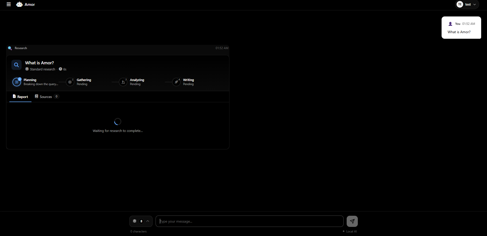

# Amor

Distributed multi-mode research / reasoning / coding stack. Local Ollama + Claude API, FastAPI + MongoDB + Redis + Kafka under an nginx gateway.



## Quick Start

**Prerequisites:** Docker 24+, ~8 GB RAM, ~10 GB free disk for the Ollama model.

**Linux / macOS**

```bash
git clone https://github.com/devloper-gazi/Amor-Distributed-Artificial-Intelligence-System.git
cd Amor-Distributed-Artificial-Intelligence-System
cp .env.example .env       # then edit if you need API keys
chmod +x start.sh
./start.sh
```

**Windows (PowerShell)**

```powershell
git clone https://github.com/devloper-gazi/Amor-Distributed-Artificial-Intelligence-System.git
cd Amor-Distributed-Artificial-Intelligence-System
Copy-Item .env.example .env
Set-ExecutionPolicy -Scope Process -ExecutionPolicy Bypass -Force
.\start.ps1
```

The script pulls images, builds the app, brings the stack up, and pulls
`qwen2.5:7b` into Ollama (5–10 min on first run). When it finishes:

| Service        | URL                                  | Default credentials |
|----------------|--------------------------------------|---------------------|
| Web app        | http://localhost:8000                | register in the overlay |
| API docs       | http://localhost:8000/docs           | —                   |
| Grafana        | http://localhost:3000                | admin / admin123    |
| Prometheus     | http://localhost:9091                | —                   |

Open the web app, click **Create account** in the auth overlay, then send
your first message.

## What's included

**Modes**

- **Research** — web search + synthesis with cited sources, streamed live over SSE
- **Thinking** — clarify-first multi-phase reasoning (understand → decompose → explore → evaluate → synthesize → critique)
- **Coding** — code generation, review, debugging

**Providers**

- **Local AI** — Ollama, default model `qwen2.5:7b` (override with `OLLAMA_MODEL`)
- **Claude API** — set `ANTHROPIC_API_KEY` and toggle "Use Claude API" in the UI

**Stack** (all run from `docker-compose.yml`)

- `gateway` — nginx, single entrypoint on `:8000`
- `app` — FastAPI, 2 replicas behind the gateway
- `mongo` — chat sessions, messages, query records
- `redis` — auth tokens, SSE pub/sub fan-out, cache
- `postgres` — relational store for the document pipeline
- `kafka` + `zookeeper` — async document ingestion bus
- `ollama` — local model inference
- `prometheus` + `grafana` — metrics and dashboards

## Configuration

All keys live in `.env` (copied from `.env.example`). The ones you'll
actually touch:

| Key                          | Controls                                  | Default                |
|------------------------------|-------------------------------------------|------------------------|
| `ANTHROPIC_API_KEY`          | Enables the Claude provider               | unset                  |
| `GOOGLE_TRANSLATE_API_KEY`   | Google Translate (optional)               | unset                  |
| `AZURE_TRANSLATOR_KEY`       | Azure Translator (optional)               | unset                  |
| `OLLAMA_MODEL`               | Local model tag                           | `qwen2.5:7b`           |
| `LOG_LEVEL`                  | Python logger level                       | `INFO`                 |
| `WORKER_COUNT`               | Document-pipeline workers                 | `4`                    |
| `KAFKA_PARTITIONS`           | Topic partitions                          | `50`                   |
| `ANTHROPIC_RPM`              | Claude rate limit (requests/min)          | `50`                   |
| `MONGO_HOST` / `REDIS_HOST` / `POSTGRES_HOST` | Backing-store hosts        | auto-set by compose    |

Without any API keys set, Amor runs end-to-end on local Ollama only.

## Architecture

```
                      ┌──────────────────┐
 Browser  ──HTTP──►   │  nginx gateway   │  :8000
                      │     (single      │
                      │      entry)      │
                      └────────┬─────────┘
                               │
                       ┌───────┴───────┐
                       │  FastAPI app  │  ×2 replicas
                       │   (uvicorn)   │
                       └───┬───┬───┬───┘
                           │   │   │
              ┌────────────┘   │   └────────────┐
              ▼                ▼                ▼
        ┌──────────┐    ┌──────────┐     ┌──────────┐
        │  Mongo   │    │  Redis   │     │ Postgres │
        │ sessions │    │ pub/sub  │     │ pipeline │
        └──────────┘    └──────────┘     └──────────┘
              │                │
              ▼                ▼
        ┌──────────┐    ┌──────────────┐
        │  Ollama  │    │ Kafka + ZK   │
        │ qwen2.5  │    │ doc ingest   │
        └──────────┘    └──────────────┘

         Prometheus  ──scrapes──►  app, gateway, ollama
         Grafana     ──reads ────►  Prometheus
```

## Features

- Idempotent session creation + smart auto-titles from the first message (no more "Untitled Chat")
- In-place chat rename: context menu, double-click on the title, or <kbd>F2</kbd>
- Cancellable queries with a Stop button; resume banner re-attaches to in-flight runs after a page reload
- SSE event-queue with `TTLCache(maxsize=512, ttl=7800)` + periodic sweeper — bounded memory under load
- MongoDB resilience: exponential-backoff connect retry, `w=majority`, journaled writes, ping-validated sticky connections
- Cited research with rich-markdown chat history that re-mounts as a full card on reload
- Server-side + client-side message persistence, deduped via shared `idempotency_key`
- Dual provider with mode-specific cancel routes (`/api/thinking/{sid}/cancel`, `/api/local-ai/research/{sid}/cancel`, `/api/chat/cancel/{record_id}`)
- Per-session ownership enforced (`user_id` or `client_id`) on every chat-store route
- Prometheus metrics + Grafana dashboards out of the box
- Read-only stack TUI: `python watch_live.py`

## API

The full OpenAPI spec is live at <http://localhost:8000/docs>. Key surfaces:

| Path                                            | Purpose                                  |
|-------------------------------------------------|------------------------------------------|
| `POST /api/local-ai/research`                   | Start local-AI research, returns `session_id` |
| `POST /api/thinking/think`                      | Start a thinking pipeline                |
| `POST /api/local-ai/coding`                     | Local-AI code generation                 |
| `POST /api/chat/research` · `…/thinking` · `…/coding` | Claude-API equivalents             |
| `GET  /api/{thinking,local-ai/research}/{sid}/events` | SSE stream of phase events       |
| `POST /api/{thinking,local-ai/research}/{sid}/cancel` | Halt a running pipeline          |
| `GET  /api/sessions` · `POST /api/sessions`     | List / create chat sessions              |
| `POST /api/sessions/{sid}/auto-title`           | Smart-title from first message           |
| `GET  /api/sessions/{sid}/active-query`         | Resume probe for in-flight work          |
| `POST /api/query-records` · `GET /api/sessions/{sid}/query-records` | Per-query records      |
| `GET  /health`                                  | Liveness probe                           |

## Development

```bash
# Run unit tests
pytest -q

# Tail the stack with the read-only live monitor
python watch_live.py

# Watch container logs
docker compose logs -f app gateway ollama
```

## Troubleshooting

- **Ollama model didn't pull** — `docker exec amor-ollama ollama pull qwen2.5:7b`
- **`401 Unauthorized` in the browser** — register an account in the auth overlay first
- **Mongo "connection refused" right after `up -d`** — wait ~30 s for the healthchecks; the new connect-retry will recover automatically
- **Port 8000 already in use** — `docker compose down` first, or change the gateway mapping in `docker-compose.yml`
- **Reset everything (drop volumes)** — `docker compose down -v`

## Further reading

- [`QUICK_START.md`](QUICK_START.md) — extended setup notes for unusual platforms
- [`LOCAL_AI_SETUP.md`](LOCAL_AI_SETUP.md) — Ollama tuning + alternative models
- [`RESEARCH_GUIDE.md`](RESEARCH_GUIDE.md) — research mode internals
- [`AGENTS.md`](AGENTS.md) — contributor / agent guide

## License

MIT — see [`LICENSE`](LICENSE).
