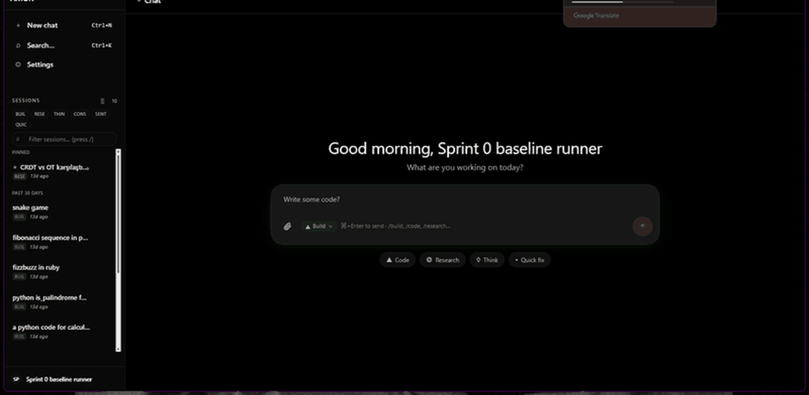
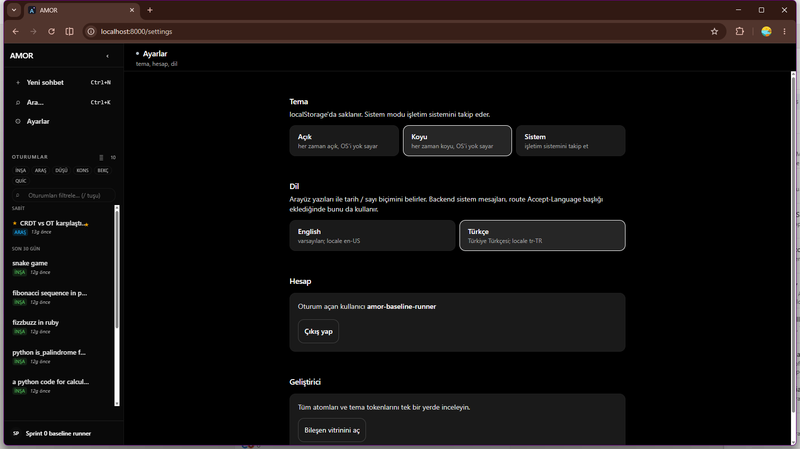
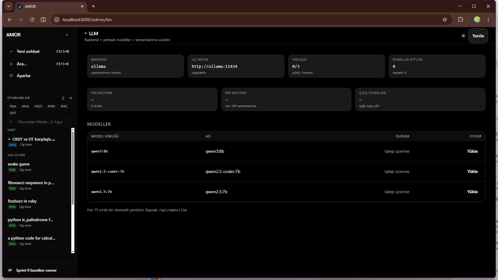

# Amor — Distributed Artificial Intelligence System

[](https://github.com/devloper-gazi/Amor-Distributed-Artificial-Intelligence-System/releases/latest)
[](https://github.com/devloper-gazi/Amor-Distributed-Artificial-Intelligence-System/tags)
[](LICENSE)
[](#)
[](#)
[](#)

A multi-mode local-first AI workstation: research, deep reasoning,
multi-agent code generation, a reactor-driven empirical-perf code
pipeline, and a fully-automated end-to-end consortium that chains
all four. FastAPI + MongoDB + Redis + Postgres + Kafka under an
nginx gateway, Ollama for local inference, optional Claude API.


100% local out of the box. Zero paid-API cost unless you opt in.

---

## What's new in v2.8.4 — Cycle UI: Halo + Attachments + Sessions Overhaul

**Released 2026-05-23.** 13-tag birikim (v2.6.0 → v2.8.4), frontend
yüzeyini "kontrol paneli"nden 2026 frontier "alan" yüzeyine
(Gemini / Claude.ai / ChatGPT seviyesi) taşır. Full release notes:
[**v2.8.4 release page**](https://github.com/devloper-gazi/Amor-Distributed-Artificial-Intelligence-System/releases/tag/v2.8.4).

<table>
<tr>
<td width="50%" valign="top">

**Cycle UI v2.6 — Minimal chat surface**
- **Halo**: composer'ı saran mode-tinted 480px radial gradient + 14s blob drift, `prefers-reduced-motion` guard
- **Greeting**: saat-dilimi koşullu kişiselleştirilmiş selam, Türkçe `localeUpper` casing
- **EmptyState**: 4-row seed grid (Build / Research / Thinking / QuickCode)
- **Sidebar şeffaflaşma**: `bg-bg-elevated-v25/70 backdrop-blur-md`, accordion sections
- **Native keyboard shortcuts**: Cmd+K palette, Cmd+N new session, Cmd+B sidebar
- **Composer premium polish**: card shell + icon-only ↑ Send + pastel mode pill

</td>
<td width="50%" valign="top">

**Cycle UI v2.7 — Attachment system E2E**
- **Multipart upload** → filesystem `data/attachments/{user_id}/{yyyy-mm}/{uuid}.{ext}`
- **MongoDB persist** `attachments_meta` collection + sha256 dedup + 60s cache
- **LLM context inject** AMOR-ATTACH:START/END sentinel blocks, 32 KB/file, 96 KB/total
- **6 endpoint extended** (code / research / thinking / consortium / sentinel / quickcode)
- **Vision capability detect**: Ollama `/api/tags` → 11-pattern whitelist (qwen2-vl, llava, phi3-vision, …)
- **Approval policy hook**: >5MB / image / PDF → policy event
- **Drag-drop + paste-clipboard** + size/MIME validation

</td>
</tr>
<tr>
<td valign="top">

**Cycle UI v2.8 — Sessions system (Gemini + Claude best-of)**
- Sidebar action buttons (+ Yeni sohbet / ⌕ Ara / ⚙ Ayarlar)
- Suggestion chips below composer
- **Inline session search** (`/` shortcut)
- **Density toggle** (compact ↔ comfortable, localStorage persist)
- **Refined recency** (today / yesterday / past_week / past_month / older)
- **Mode filter chip bar** (multi-select)
- **Double-click inline rename**, **keyboard arrow nav** (Up/Down/Enter, Cmd+P pin)
- **Hover-pin** + polished empty state

</td>
<td valign="top">

**Setup reliability**
- **start.cmd + setup.cmd wrappers**: PowerShell ExecutionPolicy bypass per-invocation
- **UTF-8 BOM + ASCII em-dash** in `.ps1` (PS 5.1 CP-1252 parse hatası fix)
- **Auto-heal gateway 502/503/504**: nginx upstream DNS cache stale → otomatik `compose restart gateway` + re-probe
- **263 vitest pass**, axe-core 0 serious/critical, WCAG 2.2 AA
- **Bundle**: 112 → 125.54 KB gz (+13.5 KB, 30 KB budget'in %45'i)

</td>
</tr>
</table>

### Feature gallery (v2.8.4)

| Sessions sidebar (chip filter + search + density + recency groups) | Settings (theme + language + account) |
|---|---|
|  |  |

| Admin LLM (resident models + p50/p95 + cache hits) | Composer halo + suggestion chips |
|---|---|
|  |  |

---

## Quick Start

**Prerequisites:** Docker 24+, ~8 GB RAM, ~10 GB free disk for
the Ollama models, optional GPU with ≥6 GB VRAM (CPU works too).

**Linux / macOS**

```bash
git clone https://github.com/devloper-gazi/Amor-Distributed-Artificial-Intelligence-System.git
cd Amor-Distributed-Artificial-Intelligence-System
cp .env.example .env       # then edit if you need API keys
chmod +x start.sh
./start.sh
```

**Windows (PowerShell or cmd or double-click)** — v2.8.4 added a
`.cmd` wrapper that **automatically bypasses** the default
ExecutionPolicy. No more `Set-ExecutionPolicy` ritual.

```powershell
git clone https://github.com/devloper-gazi/Amor-Distributed-Artificial-Intelligence-System.git
cd Amor-Distributed-Artificial-Intelligence-System
Copy-Item .env.example .env
.\start.cmd                # bring all 12 services up + self-heal gateway
.\setup.cmd status         # health probe + URL list
.\setup.cmd stop           # graceful teardown
```

The wrapper invokes PowerShell with `-ExecutionPolicy Bypass` for
THAT run only — it does NOT modify your system policy.

The script pulls images, builds the app, brings the stack up, and
pulls `qwen2.5:7b` into Ollama (5–10 min on first run). For the
Multi-ML mesh the recommended companion model is `qwen2.5-coder:7b`
(another ~5 min — `docker exec amor-ollama ollama pull qwen2.5-coder:7b`).

When the stack is up:

| Service        | URL                                  | Default credentials       |
|----------------|--------------------------------------|---------------------------|
| Web app        | <http://localhost:8000>              | register in the overlay   |
| API docs       | <http://localhost:8000/docs>         | —                         |
| Grafana        | <http://localhost:3000>              | `admin` / `admin123`      |
| Prometheus     | <http://localhost:9091>              | —                         |
| Ollama         | <http://localhost:11434>             | —                         |

Open the web app, click **Create account** in the auth overlay,
then click any of the five capability cards on the welcome screen
to start a session.

---

## Five chat modes

| Mode | Card | Behind the scenes |
|------|------|---|
| **Conduct Research** | 🔍 | Web search + synthesis with cited sources, streamed live over SSE |
| **Analyze & Think** | 🧠 | 6-phase clarify-first reasoning (understand → decompose → explore → evaluate → synthesize → critique) |
| **Code Intelligence** | ⚙ | 9-phase multi-agent code engine (triage → plan → implement → execute → analyze → test → debug → review), Docker-sandboxed verification, adversarial reviewer |
| **Quick Code Chat** *(v2)* | 💻 | 5-phase reasoning-first lite pipeline (triage → reason → implement → verify → refine) augmented by the **Multi-ML Mesh** + **Code Synthesis Reactor**. `Quick` and `Pro` toggle on the tile picks between the lite and full engines |
| **Consortium** *(v5)* | 🏛️ | Fully-automated end-to-end pipeline: Scope → Research → Analyze & Think → Implement & verify, with quality gates between phases. Pluggable implementation engine (`code_intelligence` or `quick_code`) |

Every mode is **100% local** by default. Switching to Claude on
research / thinking / code is a single toggle (`Use Claude API`)
once `ANTHROPIC_API_KEY` is set in `.env`.

---

## Multi-ML Mesh (v9) — agent swarm under Quick Code Chat

When you pick `Quick`, your prompt goes through a swarm of
parallel specialists rather than a single LLM call:

```
                    ┌─────────────────────────────────────┐
                    │            MultiMLMesh              │
                    └─────────────────────────────────────┘
                                       │
        ┌──────────────────────────────┼──────────────────────────────┐
        ▼                              ▼                              ▼
   reason_mesh()             review_mesh(code)              arbitrate(everything)
        │                              │                              │
   ┌────┴────┐                ┌────────┼────────┐                     │
   ▼         ▼                ▼        ▼        ▼                     ▼
 General   Math            Math    Perf    Edge-Case            MetaArbiter
Reasoner Specialist        Audit   Audit   Audit
        ↓                            ↓                                 ↓
  Aggregator           collected as MeshReviews              Final verdict +
   weighted                                                 confidence +
   composite                                                production-readiness
```

Each specialist sees the same task through a different lens; the
aggregator merges + dedupes their proposals with a 1.5× specialty-axis
bonus (math reasoner's `math_soundness=0.9` outweighs general's `0.6`
on the same axis). Code auditors then scrutinise the generated code
from their own lens. The meta-arbiter synthesises everything into a
calibrated production-readiness verdict.

Self-evolution metrics land in MongoDB's `mesh_metrics` collection —
the v10 SpecialistBandit reads them to weight future ensembles
toward roles that historically produced cleaner code.

---

## Code Synthesis Reactor (v10) — empirical-perf layer

After the mesh produces code, the **Reactor** runs the v10
measurement layer that doesn't trust LLM claims:

| Layer | What it does |
|-------|---|
| **SymbolicComplexityAnalyzer** | Pure-AST Big-O upper bound; cross-checks LLM's complexity claim |
| **PerformanceBenchmarker** | Runs the code at 4 progressive scales (10/100/1k/10k), measures wall time + tracemalloc memory peak, fits a power-law to the runtime curve |
| **PropertyTestGenerator + Runner** | Catalogue invariants (sort/search/hash/dp/idempotent/...) plus optional LLM-suggested invariants, run via stdlib-only randomised harness in the sandbox |
| **TournamentRunner** *(opt-in)* | N=3 parallel candidate impls (standard / perf-bias / edge-bias), Pareto election across (correctness, runtime growth, memory, static issues) |
| **SemanticLLMCache** | Embedding-keyed Redis cache for prompt dedup; cosine ≥0.92 = HIT, 24h TTL |
| **SpecialistBandit** | Thompson-sampling read-side learner over `mesh_metrics`; reweights mesh specialists per task type |
| **CodeCorpusRAG** | LanceDB + nomic-embed-text-v1.5 retrieval of proven algorithm patterns; injected with a "RIFF, DON'T COPY" framing |
| **speculative_run** | Race cache lookup against the live mesh call; cache wins → cancel live cleanly |

Every reactor sub-system is **fail-soft** — missing dep (Hypothesis,
LanceDB, Mongo, Redis) yields a no-op, never a crash.

The reactor's output rides on the `bundle.reactor_bundle` envelope
and is rendered alongside the chat response, the SSE timeline, and
the artifact bundle (`bash run.sh test`-able).

---

## CLI

A standalone CLI mirrors the web routes — no server needed for
in-process runs.

```bash
# Quick Code Chat — 5-phase reasoning-first lite pipeline
python -m document_processor.cli quickcode "implement a numerically stable softmax in numpy" \
    --effort medium --max-refine 2 --output ./quickcode_out

# Consortium — full Scope → Research → Think → Implement
python -m document_processor.cli consortium "Build me a tiny CSV diff CLI in pure Python" \
    --depth medium --no-research --output ./consortium_out

# Run consortium with quick-code as the implement engine
python -m document_processor.cli consortium "Build a token bucket rate limiter" \
    --depth deep --implementation-engine quick_code --output ./out

# Stream against a remote AMOR server
python -m document_processor.cli quickcode "merge sort" \
    --remote http://localhost:8000 --token "$JWT"
```

Both subcommands stream live phase events to stdout with ANSI
badges, write the runnable artifact bundle on completion (with
`requirements.txt`, `run.sh`, `pyproject.toml`, `src/`, `tests/`,
`docs/`, `reports/`), and exit with a non-zero status when any
gate fails so CI can catch regressions.

Exit codes: `0` ok, `1` engine error / failed gate, `2` invalid
args, `130` cancelled.

---

## Providers

- **Local AI** — Ollama, default model `qwen2.5:7b`.
  Recommended companions for the v9 mesh: `qwen2.5-coder:7b`
  (code specialist), `qwen2.5-math` for math reasoning. Override
  via `OLLAMA_MODEL` or per-role bindings in the model picker.
- **Claude API** — set `ANTHROPIC_API_KEY` and toggle
  `Use Claude API` in the UI for research / thinking / code modes.
  Quick Code Chat + Consortium are always local.

The `X-Model-Used: <tag>` response header on every AI start endpoint
lets the picker UI verify which model the run will actually use.

---

## Stack

```
                      ┌──────────────────┐
 Browser  ──HTTP──►   │  nginx gateway   │  :8000
                      │  (single entry)  │
                      └────────┬─────────┘
                               │
                       ┌───────┴───────┐
                       │  FastAPI app  │  ×2 replicas
                       │   (uvicorn)   │
                       └───┬───┬───┬───┘
                           │   │   │
              ┌────────────┘   │   └────────────┐
              ▼                ▼                ▼
        ┌──────────┐    ┌──────────┐     ┌──────────┐
        │  Mongo   │    │  Redis   │     │ Postgres │
        │ sessions │    │ pub/sub  │     │ pipeline │
        │ + mesh   │    │ + cache  │     │ + jobs   │
        │ metrics  │    │ + LLM    │     │          │
        │          │    │ cache    │     │          │
        └──────────┘    └──────────┘     └──────────┘
              │                │
              ▼                ▼
        ┌──────────┐    ┌──────────────┐
        │  Ollama  │    │ Kafka + ZK   │
        │ qwen2.5  │    │ doc ingest   │
        │ + coder  │    │              │
        └──────────┘    └──────────────┘
              │
              ▼
        ┌──────────┐
        │ LanceDB  │   nomic-embed-text-v1.5 (768-d)
        │ corpus   │   for the v10 RAG layer
        └──────────┘

         Prometheus  ──scrapes──►  app, gateway, ollama
         Grafana     ──reads ────►  Prometheus
```

Every container is in `docker-compose.yml`; bring the whole stack
up or down with `docker compose up -d` / `docker compose down`.

---

## Configuration

All keys live in `.env` (copied from `.env.example`). Common ones:

| Key                                    | Controls                                  | Default                |
|----------------------------------------|-------------------------------------------|------------------------|
| `ANTHROPIC_API_KEY`                    | Enables the Claude provider               | unset                  |
| `OLLAMA_MODEL`                         | Default local model tag                   | `qwen2.5:7b`           |
| `LOG_LEVEL`                            | Python logger level                       | `INFO`                 |
| `WORKER_COUNT`                         | Document-pipeline workers                 | `4`                    |

**Code Intelligence + sandbox**

| Key                                    | Controls                                  | Default                |
|----------------------------------------|-------------------------------------------|------------------------|
| `CODE_SANDBOX_ENABLED`                 | Docker sandbox for code exec              | `true`                 |
| `CODE_SANDBOX_TIMEOUT`                 | Per-execution timeout (s)                 | `30`                   |
| `CODE_SANDBOX_MEMORY`                  | cgroup memory cap                         | `256m`                 |
| `CODE_MAX_DEBUG_ITERATIONS`            | Refine cap                                | `3`                    |

**v10 Reactor knobs**

| Key                                    | Controls                                  | Default                |
|----------------------------------------|-------------------------------------------|------------------------|
| `CODE_REACTOR_ENABLED`                 | Master gate                               | `true`                 |
| `CODE_REACTOR_FEATURES`                | Comma-separated subset                    | all 7                  |
| `CODE_TOURNAMENT_N`                    | Parallel candidates                       | `3`                    |
| `CODE_BENCH_SCALES`                    | Progressive bench scales                  | `10,100,1000,10000`    |
| `CODE_RAG_TOP_K`                       | Retrieved patterns per call               | `3`                    |
| `CODE_LLM_CACHE_TTL_S`                 | Semantic cache TTL                        | `86400`                |
| `CODE_REACTOR_CACHE_SALT`              | Bump to invalidate every cache entry      | `1`                    |

Without any API keys set, Amor runs end-to-end on local Ollama only.

---

## Features

### Cross-cutting

- **Multi-replica safe** — Redis pub/sub + cancel channel + heartbeat
  pump (20 s) so a `/cancel` POST against a different replica than
  the running task still propagates within ~10 ms. Zombie detection
  at lifespan startup + periodic 5-min sweep.
- **SSE event-queue with `event_id` dedup** — `TTLCache(maxsize=512,
  ttl=7800)` per-session queue, every event stamped with a UUID so
  the Redis pub/sub fan-out + local queue never deliver duplicates
  to subscribers.
- **MongoDB resilience** — exponential-backoff connect retry,
  `w=majority`, journaled writes, ping-validated sticky connections.
- **Adversarial reviewer** — synchronous filter on every emitted
  event (prompt injection / secret leakage / shell injection /
  untrusted-URL execution), blocks critical matches and persists
  alerts to `adversarial_events`.
- **Prometheus + Grafana** dashboards out of the box, metrics
  scraped from the gateway, app replicas, and Ollama.
- **Live monitor** — read-only TUI: `python watch_live.py` shows
  every active session's progress with weighted ETA, gate counts,
  and heartbeat severity.

### Per-mode highlights

- **Quick Code Chat tile** — Quick (5-phase) / Pro (9-phase) toggle
  pill rendered as an iOS-style sliding-thumb segmented control;
  `data-active` attribute drives a CSS-only thumb translation; v2
  badge in cyan to differentiate from Consortium's purple v5.
- **Consortium artifact bundle** — every run writes a runnable
  Python project layout: `requirements.txt` (auto-detected from
  AST imports), `run.sh` (venv bootstrap + run + test + clean),
  `pyproject.toml`, `.gitignore`, `src/`, `tests/`, `docs/`,
  `reports/`. Just download the zip and `bash run.sh setup`.
- **Cross-replica state sync** — Redis-first reads on `/status`,
  `/cancel`, `/events`, `/artifact` so a request against any replica
  sees the bg task's latest state.

---

## API

The full OpenAPI spec is live at <http://localhost:8000/docs>. Key
surfaces by mode:

### Research

| Path                                                | Purpose                       |
|-----------------------------------------------------|-------------------------------|
| `POST /api/local-ai/research`                       | Start (returns `session_id`)  |
| `GET  /api/local-ai/research/{sid}/events`          | SSE stream                    |
| `POST /api/local-ai/research/{sid}/cancel`          | Halt a running pipeline       |

### Thinking

| Path                                              | Purpose                       |
|---------------------------------------------------|-------------------------------|
| `POST /api/thinking/think`                        | Start                         |
| `GET  /api/thinking/{sid}/events`                 | SSE stream                    |
| `POST /api/thinking/{sid}/cancel`                 | Halt                          |

### Code Intelligence (Pro, 9-phase)

| Path                                              | Purpose                       |
|---------------------------------------------------|-------------------------------|
| `POST /api/code/start`                            | Start full pipeline           |
| `POST /api/code/triage`                           | Fast classification           |
| `GET  /api/code/{sid}/events`                     | SSE stream                    |
| `POST /api/code/{sid}/cancel`                     | Halt                          |
| `GET  /api/code/sandbox/health`                   | Docker / image availability   |

### Quick Code Chat (Quick, 5-phase + mesh + reactor)

| Path                                              | Purpose                       |
|---------------------------------------------------|-------------------------------|
| `POST /api/quick-code/start`                      | Start (returns `session_id`)  |
| `GET  /api/quick-code/{sid}/events`               | SSE stream                    |
| `GET  /api/quick-code/{sid}/status`               | Snapshot (8-phase scaffold)   |
| `POST /api/quick-code/{sid}/cancel`               | Halt                          |
| `GET  /api/quick-code/{sid}/artifact`             | Runnable zip download         |

### Consortium

| Path                                              | Purpose                       |
|---------------------------------------------------|-------------------------------|
| `POST /api/consortium/start`                      | Start full Scope→Research→Think→Implement |
| `GET  /api/consortium/{sid}/events`               | SSE stream                    |
| `GET  /api/consortium/{sid}/status`               | Phase snapshot + verifications |
| `POST /api/consortium/{sid}/cancel`               | Halt                          |
| `GET  /api/consortium/{sid}/artifact`             | Runnable zip download         |

### Sentinel — Multi-Agent Local Security Intelligence (V1)

The 6th capability card on the homepage.  A multi-agent security
audit pipeline that runs **100 % local** on the existing 8 GB GPU
host with zero external API, zero telemetry.

Pipeline stages:

```
input → static_swarm → ml_pipeline → aggregate
      → rag_enrich → auditor (3×) → reasoner → redteam
      → patcher → critic_loop → judge
      → score → SARIF / MD / HTML
```

Five-agent swarm multiplexed onto the two installed Ollama models:

| Role     | Model              | Temperature | Why |
|----------|--------------------|-------------|-----|
| Auditor  | qwen2.5-coder:7b   | 0.2         | 3× voting, code-tuned, strict JSON |
| Reasoner | qwen2.5:7b         | 0.5         | CoT exploit-chain narrative |
| RedTeam  | qwen2.5-coder:7b   | 0.7         | Concrete payloads, no hedging |
| Patcher  | qwen2.5-coder:7b   | 0.2         | Deterministic full-function rewrites |
| Judge    | qwen2.5:7b         | 0.0         | Calibrated final synthesis |

Static-analysis swarm with graceful skip on missing tools:
**bandit**, **pylint**, **mypy** (in `requirements.txt`) +
**semgrep**, **gitleaks**, **trivy fs**, **gosec**, **cppcheck**
(pulled if you want them; if not, the wrapper just emits a
`tool_skipped` event and continues).

Classical ML pipeline with pure-Python heuristics by default;
optional `scikit-learn` / `xgboost` upgrades light up automatically
when you install them.

| Path                                              | Purpose                       |
|---------------------------------------------------|-------------------------------|
| `POST /api/sentinel/start`                        | Start a scan (quick / standard / deep / paranoid) |
| `GET  /api/sentinel/{sid}/events`                 | SSE stream of phase events |
| `GET  /api/sentinel/{sid}/status`                 | Phases + bundle snapshot |
| `POST /api/sentinel/{sid}/cancel`                 | Halt mid-scan |
| `GET  /api/sentinel/{sid}/artifact?format=…`      | Download SARIF / Markdown / HTML / zip |

**Scan profiles**

| Profile  | Stages                                           | Time  |
|----------|--------------------------------------------------|-------|
| quick    | static + ML only                                 | ~30 s |
| standard | + auditor (3×) + patcher + critic + judge        | ~3 min |
| deep     | + reasoner + redteam                             | ~10-15 min |
| paranoid | deep + synthetic injection self-test            | ~25-30 min |

The output is **SARIF 2.1.0** (open the `.sarif` file in VS Code
with the SARIF Viewer extension), **GitHub-friendly Markdown**, or
a single-file CSP-strict **HTML** report.

See `docs/sentinel-architecture.md` and
`docs/sentinel-agent-prompts.md` for the full design.

Every start endpoint emits an `X-Model-Used: <tag>` response header
so the picker UI can confirm which model the run uses.

---

## Development

```bash
# Run the full unit + integration suite (~25 s)
pytest -q

# Just the v10 reactor + v9 mesh + Quick Code Chat tests
pytest tests/code_intelligence/reactor tests/code_intelligence/mesh \
       tests/quick_code -q

# Tail the stack with the read-only live monitor
python watch_live.py

# Watch container logs
docker compose logs -f app gateway ollama
```

---

## Troubleshooting

- **Ollama model didn't pull** — `docker exec amor-ollama ollama pull qwen2.5:7b`
- **`401 Unauthorized` in the browser on research/thinking/code modes** —
  register an account in the auth overlay first. Quick Code Chat +
  Consortium accept anonymous sessions (`X-Client-Id` header) so
  they work without registering.
- **Mongo "connection refused" right after `up -d`** — wait ~30 s
  for the healthchecks; the connect-retry loop recovers automatically.
- **Reactor / mesh tests fail with "no Mongo"** — start the stack
  first (`docker compose up -d mongo`) or expect the fallback dict
  paths to absorb the misses.
- **Port 8000 already in use** — `docker compose down` first, or
  change the gateway mapping in `docker-compose.yml`.
- **Reset everything (drop volumes)** — `docker compose down -v`.

---

## Mode-specific docs

- [`docs/code_intelligence/`](docs/code_intelligence/) — full design
  notes for the 9-phase Code Intelligence engine
  - [`ARCHITECTURE.md`](docs/code_intelligence/ARCHITECTURE.md) —
    layered design + per-session lifecycle
  - [`RUNBOOK.md`](docs/code_intelligence/RUNBOOK.md) — operator guide
  - [`EXTENDING.md`](docs/code_intelligence/EXTENDING.md) — recipes:
    add an agent, sandbox tier, model provider, capability source
  - [`adr/`](docs/code_intelligence/adr/) — architectural decision
    records
- [`docs/MODEL_PICKER_AUDIT.md`](docs/MODEL_PICKER_AUDIT.md) — spec →
  implementation map for the model picker
- [`QUICK_START.md`](QUICK_START.md) — extended setup notes
- [`LOCAL_AI_SETUP.md`](LOCAL_AI_SETUP.md) — Ollama tuning + alternative models
- [`RESEARCH_GUIDE.md`](RESEARCH_GUIDE.md) — research mode internals
- [`AGENTS.md`](AGENTS.md) — contributor / agent guide

---

## Versioning

The branch `feat/code-intelligence-mode-v2` carries every recent
round; meaningful tags as features land:

| Tag | Round | Highlights |
|-----|-------|------------|
| v5  | Consortium | Scope → Research → Think → Implement meta-pipeline + CLI |
| v6  | Model picker audit | `X-Model-Used` header on every AI start endpoint |
| v7  | Quick Code Chat | 5-phase reasoning-first lite pipeline + tile toggle |
| v8  | Artifact bundle | `requirements.txt` / `run.sh` / `pyproject.toml` / `src,tests,docs/` |
| v9  | Multi-ML Mesh | 4 parallel reasoning specialists + 3 code auditors + meta-arbiter |
| v10 | Code Synthesis Reactor | Empirical perf measurement + RAG + tournament + bandit + cache |

---

## License

MIT — see [`LICENSE`](LICENSE) and [`LICENSE_NOTES.md`](LICENSE_NOTES.md).
