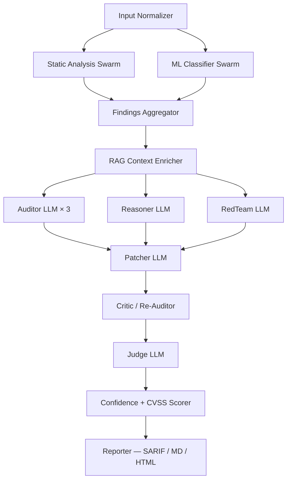

# Sentinel — Architecture (V1)

Multi-agent local security intelligence module — the 6th capability
on the AMOR homepage.  Mirrors the Consortium pattern, specialises
it for security audit.

## Goals & non-goals

**Goals**

* 100 % local — no external API, no telemetry, no CDN-bound asset.
* Multi-agent self-consistency: Auditor 3× voting, Critic loop on
  patches, Auditor↔RedTeam debate with Judge tie-break (Phase 9
  self-play).
* Bayesian merging across sources (static / ML / agent) so a single
  weak signal cannot dominate the verdict.
* Fail-soft everywhere — missing tools (semgrep / gitleaks / trivy
  / sklearn / xgboost) just degrade the pipeline; the engine still
  runs and reports.
* No content filters or refusal language in any V1 prompt template.

**Non-goals (V1)**

* Real CodeBERT / Devign / BigVul training (heuristics + optional
  sklearn instead).
* Live auto-update of CWE / OWASP corpora — manual refresh only.
* Runtime / dynamic analysis (fuzzing, network testing).
* Hardware-level vulnerabilities (Spectre / Meltdown).
* Multi-repo cross-correlation across orgs / users.

## DAG



## Scan profiles

| Profile  | Stages                                           | Time |
|----------|--------------------------------------------------|------|
| quick    | static + ML only                                 | ~30 s |
| standard | + auditor (3×) + patcher + critic + judge        | ~3 min |
| deep     | + reasoner + redteam                             | ~10-15 min |
| paranoid | deep + synthetic injection self-test            | ~25-30 min |

## Multi-agent swarm (5 roles, 2 models)

The 8 GB GPU host can keep two ~5 GB Q4 models swapping in Ollama's
in-memory cache.  Sentinel V1 multiplexes five logical roles onto
those two models:

| Role     | Model              | Temp | Why this model |
|----------|--------------------|------|----------------|
| Auditor  | qwen2.5-coder:7b   | 0.2  | Code-tuned; strict JSON output |
| Reasoner | qwen2.5:7b         | 0.5  | Stronger natural-language CoT |
| RedTeam  | qwen2.5-coder:7b   | 0.7  | Code-tuned; needs concrete payloads |
| Patcher  | qwen2.5-coder:7b   | 0.2  | Code-tuned; deterministic rewrites |
| Judge    | qwen2.5:7b         | 0.0  | Calibrated synthesis |

The Role → Model map is configurable via
``settings.sentinel_<role>_model``.  Hosts with ≥ 24 GB GPU can
opt in to a 32 B specialist by flipping the matching flag in
``settings.py``.

## Static-analysis swarm

Tools (graceful skip when binary / Python module is absent):

* bandit (Python module)
* pylint (Python module)
* mypy (Python module)
* radon (Python module)
* semgrep (binary on PATH)
* gitleaks (binary on PATH)
* trivy fs (binary on PATH)
* gosec (binary on PATH)
* cppcheck (binary on PATH)

Each wrapper returns a list of normalised ``Finding`` records.  Per-
tool weights live in ``data/source_weights.json`` and feed the
Bayesian merge.

## Classical ML pipeline

Pure-Python heuristics by default; optional sklearn / xgboost /
onnxruntime when installed:

* **Secret detector** — regex catalogue + Shannon-entropy fallback.
  Optional ``RandomForestClassifier`` if a pickle is present.
* **Anomaly detector** — per-file Z-score on
  ``(loc, complexity_proxy, imports, base64_density)``.  Optional
  ``IsolationForest``.
* **Severity ranker** — weighted-sum heuristic.  Optional
  ``XGBClassifier`` when ``xgboost`` is installed.

Active backend is logged at engine startup so the user knows
whether they're getting the advanced or fallback path.

## RAG (LanceDB)

Reuses ``local_ai/vector_store/lancedb_store.py``.  Four logical
tables:

* ``sentinel_cwe`` — bundled MITRE CWE Top-25 (25 entries).
* ``sentinel_owasp`` — bundled OWASP Top 10 2021.
* ``sentinel_history`` — past Sentinel findings (per-user).
* ``sentinel_project`` — chunks of the currently-scanned project.

Embeddings via ``nomic-embed-text-v1.5`` on CPU when
sentence-transformers is installed; deterministic 96-dim hash
sketch otherwise.

## Bayesian merge

```
final_confidence = 1 − ∏(1 − cᵢ * wᵢ)
```

per ``(file, line, cwe)`` triple, sources assumed independent.
Weights from ``data/source_weights.json``.  Tool overrides take
priority (e.g. gitleaks=0.85, pylint=0.45).

## CVSS

Trusted upstream score (Trivy is the only tool that emits one)
when present; otherwise falls back to the bundled
``data/cwe_cvss_map.json`` priors for ~30 common CWEs.

## Network isolation

Static check: no Sentinel module imports a network library at top
level.  All HTTP traffic flows through the existing Ollama bridge
which talks ``localhost:11434`` only.

Runtime check: ``tests/sentinel/test_network_isolation.py`` runs
``Get-NetTCPConnection`` on Windows or ``ss`` on Linux; the test
asserts no non-loopback connections during a Quick scan and skips
cleanly on hosts without either tool.

## VRAM budget

| Profile  | Peak VRAM | Notes |
|----------|-----------|-------|
| quick    | < 200 MB  | static + ML only; no LLM swap |
| standard | ~5 GB     | one 7B model loaded at a time |
| deep     | ~5 GB     | Ollama swaps between qwen2.5:7b and qwen2.5-coder:7b |
| paranoid | ~5 GB     | same as deep + self-test injection |

The 32B specialist + speculative-decoding flags exist for hosts
with ≥ 24 GB GPU but ship default-off on this 8 GB target.

## Threat model

* The user submits paths or pasted code.  We trust the user.
* The code is read-only — no execution unless the user explicitly
  asks for ``exploit_sandbox`` (which routes through the existing
  ``ExecutionSandbox`` with ``--network=none --memory=256m
  --read-only``).
* The CWE / OWASP corpora are bundled snapshots — not refreshed at
  runtime.  Drift is the user's responsibility (manual ``amor
  sentinel update-cwe`` lands in V1.1).
* AdversarialReviewer at the routes layer continues to filter
  prompt injection / shell injection / secret leakage on every SSE
  event before it leaves the engine.

## License

MIT — matches the parent repo.
